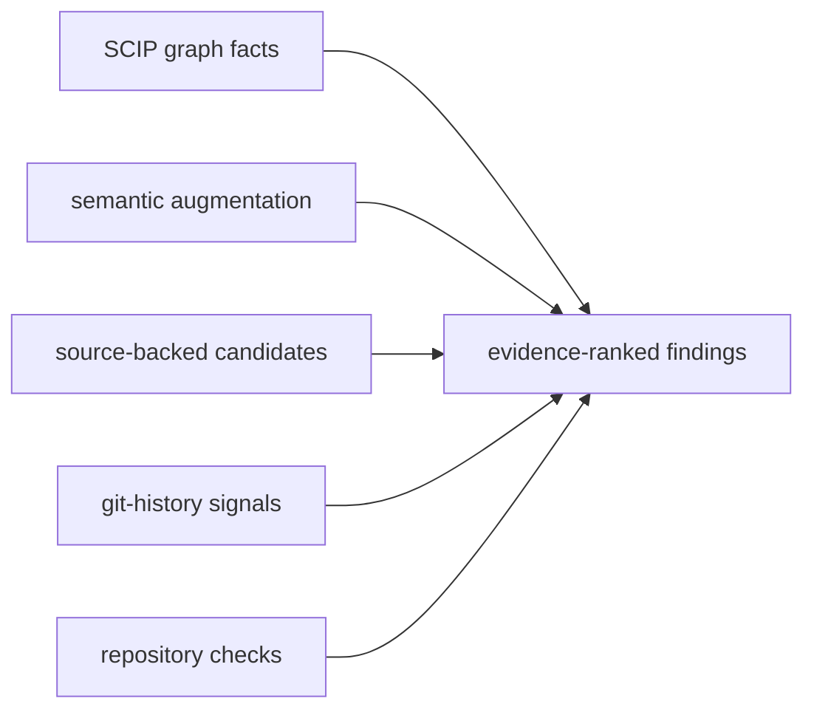

<h1 align="center">
  <picture>
    <source media="(prefers-color-scheme: dark)" srcset="docs/assets/scip-query-logo-dark.svg">
    
  </picture>
</h1>

<p align="center">
  <strong>Evidence and verification for AI coding agents.</strong>
</p>

<p align="center">
  <em>Map the repo. Reuse what exists. Finish the refactor. Gate the diff.</em>
</p>

<p align="center">
  <a href="https://www.npmjs.com/package/scip-query"></a>
  <a href="https://www.npmjs.com/package/scip-query"></a>
  <a href="package.json"></a>
  <a href="https://www.apache.org/licenses/LICENSE-2.0"></a>
</p>

`scip-query` gives AI coding agents compiler-grade evidence about your repository and mechanical gates on what they produce. Under the hood it is a TypeScript CLI and npm package built on SCIP indexes, git history, language-aware source analysis, and your repository's own checks.

Agents are effective at editing the code in front of them. They are less reliable at preserving a whole-repository model across a long task: they miss existing helpers, plan from partial context, migrate only some call sites, overlook files coupled only by history, and declare a diff finished while it still adds duplication, dead code, or stale documentation.

`scip-query` gives them a repeatable operating loop: map the target and its blast radius, build a concrete plan from repository evidence, check for reuse before adding a concept, detect unfinished migrations and hidden coupling, and gate the final diff. It does not replace the compiler, tests, or review; it makes structural evidence and repository checks easy for agents to invoke and report.

## How Agents Use It

Two layers, wired by `scip-query setup`:

**Ambient** — no invocation required. Session-start hooks supply index state and routing context; the Stop-hook / pre-commit **diff gate** checks every finished diff for echoes of existing code, unfinished migrations, missing co-change partners, stale doc citations, and new dead code — and feeds findings back to the agent.

**Invoked** — the agent routes work through skills, each carrying its own short command list so it never navigates the full CLI:

| Phase     | Skill                                                    | Commands underneath (also usable directly)      |
| --------- | -------------------------------------------------------- | ----------------------------------------------- |
| Orient    | `scip-explore`                                            | `system`, `trace`, `plan-context`, `call-graph` |
| Plan      | `scip-concrete-plan` (one change) · `scip-conductor` (a program) | `plan-context`, `change-surface`, `co-change`   |
| Reuse     | (taught in-loop by the planning skills)                   | `similar`, `duplicate-bodies`, `recent-duplicates` |
| Implement | your agent + the post-change check for the change type    | `incomplete-migration`, `unused-params`, `co-change` |
| Verify    | `scip-verify` (closeout) + the ambient diff gate          | `diff-impact`, `diff-gate`, `health --baseline` |
| Clean up  | `scip-cleanup-audit` → `scip-cleanup-improve`             | `cleanup-plan --verify`, `dead`, `twin-drift`   |

Interrogation lenses go deeper on demand: `scip-integrity-audit` ("is this implementation real?"), `scip-twin-drift`, `scip-claim-audit`, `scip-probe-reachability`, and `scip-maintainability`. The full map with essential differences is in [Bundled skills](#bundled-skills); every command remains directly invocable for humans and scripts.

React and Vue repositories get additional framework-aware checks for repeated component/template structure, hook/composable behavior, and large-component or large-view pressure. These extend the same reuse and completion workflow; the core graph, history, planning, cleanup, and diff-gate commands are not frontend-specific.

## Install

`npm install` only installs the package — it does not touch your home directory, your shell config, or any agent's skill/hook setup. Every write happens explicitly, when you ask for it:

```bash
npm install -g scip-query@latest
scip-query setup           # opt-in: skills, project hooks, first index, health dossier
scip-query check-deps
scip-query reindex
```

Or without a global install: `npx scip-query@latest reindex`.

### If npm warns about install scripts

On npm setups with script approval enabled (`allow-scripts`), the install prints warnings like
`15 packages have install scripts not yet covered by allowScripts` — and **skips those scripts**,
which leaves the native modules unbuilt. Every script on that list is expected:

- `scip-query` — its own postinstall (non-fatal by construction: `... || true`)
- `better-sqlite3` — builds/downloads the native SQLite binding that backs the index
- `tree-sitter` + the per-language grammars — native parsers behind multi-language source facts

Approve them and re-run the builds (`--allow-scripts-pending` only *lists* — the approving forms
are `npm approve-scripts <pkg> ...` or `--all`):

```bash
npm approve-scripts --all        # approve every pending install script (review the list first
                                 # with: npm approve-scripts --allow-scripts-pending)
npm rebuild                      # run the now-approved build scripts
scip-query status --capabilities # verify: languages should show as available
```

This approval is deliberately yours to make — a package cannot approve its own install scripts,
and one that tried would be exactly the kind of supply-chain behavior to distrust.

## Start with One Change

```bash
# Before editing: establish structure, consumers, history, and blast radius
scip-query plan-context <symbol-or-file>

# Before creating a helper or abstraction: look for the existing concept
scip-query similar <closest-symbol>

# After an extraction or migration: find sites that still contain old logic
scip-query incomplete-migration

# Before declaring the work complete: refresh the index and gate the diff
scip-query reindex && scip-query diff-gate --json
```

For a repository-wide cleanup pass:

```bash
scip-query health
scip-query recent-duplicates
scip-query cleanup-plan --verify
scip-query health --write-baseline
```

## Evidence and Confidence

`scip-query` keeps the source and strength of each answer visible:



1. **SCIP graph facts** for definitions, references, imports, calls, and dependencies.
2. **Semantic augmentation** for TypeScript where the SCIP index needs more detail.
3. **Source-backed candidates** for similarity, maintainability, and cleanup checks.
4. **Git-history signals** for churn, co-change, recency, and documentation drift.
5. **Repository-toolchain verification** for supported cleanup plans.

Heuristic findings are candidates for inspection, not proof of equivalence or bad design. Run `scip-query capabilities` to see which evidence and verification layers are available for the current repository and language.

## Language and Framework Coverage

Graph navigation works through supported [SCIP](https://github.com/sourcegraph/scip) indexers. Higher-confidence augmentation and verification vary by language and project toolchain. TypeScript currently has the richest semantic augmentation. React and Vue add built-in framework-aware maintainability checks on top of the core workflow.

Clojure projects are indexed through `scip-clojure`. Source fallback adds namespace imports, callable/callsite evidence, and protocol/record member evidence for `.clj`, `.cljs`, and `.cljc` files. When the project has `clj-kondo` available, cleanup-plan verification can use `clj-kondo --lint .`. Clojure does not currently have a scip-query semantic provider equivalent to TypeScript's `ts-morph` layer; capability output reports that boundary explicitly.

## Cleaning Up AI-Generated Code

These checks target specific ways AI-assisted development rots a codebase. The full catalog, with prevention wiring for each detector, is in [docs/AI_FAILURE_MODES.md](docs/AI_FAILURE_MODES.md):

**1. Find the echoes.** Agents re-implement helpers, hooks, composables, and frontend components they didn't know existed. `recent-duplicates` makes similarity _directional_ using git file ages - which side is the established original, which is the recent echo.

Illustrative output:

```
91%  ECHO  react-component  src/components/ProjectCardVisual.tsx  ProjectCardVisual  (added 62 commits ago)
     duplicates established  src/pages/HomePage.tsx  RecentProjectRow()
     basis: jsx-structure
     shared: component:ProjectCard, prop:title, event:click
100% TWIN  src/workflows/a.ts ensureAccessible() / src/workflows/b.ts ensureAccessible()
     (both new - one agent session duplicated itself; consolidate before they diverge)
```

**2. Finish the half-done extraction.** Agents extract a helper, rewire one or two call sites, and abandon the rest — the extracted logic survives inline at every site they missed. `incomplete-migration` finds helpers that are new in the diff, confirms they were wired in somewhere, and lists the established sites that still contain the helper's logic but never call it (containment scoring, because a missed site holds the helper's logic _plus_ its own).

Illustrative output:

```
src/utils/priceLabel.ts  priceLabel()
  wired into: src/cards/price-summary-a.ts
  un-migrated: 100%  buildReportB()  (src/cards/price-summary-b.ts)
  un-migrated: 100%  buildReportC()  (src/cards/price-summary-c.ts)
```

**3. Catch your standards docs lying.** If you keep in-repo standards for agents to read before implementing, a stale standard is worse than none. `doc-drift` reads every doc's file citations _and_ its co-change history, then flags docs whose code moved on without them — including **broken references** to files that no longer exist:

```
staleness 94  product/domain-model.md
  BROKEN REFERENCE: cites src/api/servicePlans.ts — that file no longer exists
  22 change(s) since doc update  src/workflows/serviceTasks.ts  (referenced by doc)
```

**4. Delete with project checks.** `cleanup-plan` runs dead-code analysis to a _fixpoint_ — deleting batch 0 makes batch 1 dead, and the plan shows the cascade. `--verify` applies each batch in a throwaway git worktree and runs the supported checker detected for your project (differentially, so pre-existing errors don't drown the signal):

```
── Batch 0: deletable now (graph-fact, 67 LOC) ──
── Batch 1: dead once batch 0 lands (cascade, 21 LOC) ──
Batch 0: COMPILER-VERIFIED
```

When verification _fails_, the errors name the exact references the static evidence missed — that failure has caught real detector mistakes and stopped build-breaking deletions.

**5. Trim speculative generality.** `unused-params` finds trailing parameters no body ever uses (the classic "options for later"), scoped to removals that are type-safe by construction.

**6. Keep frontend reuse honest.** React and Vue have dedicated frontend hygiene checks: component-duplicate commands compare JSX/template structure, hook/composable commands compare state/effect/request behavior, and large-component/view commands flag files that concentrate too many reasons to change. `health` includes these as hygiene pressure, while `incomplete-migration` remains the direct check for a hook/composable/helper extraction that was wired into some sites but not all of them.

**7. Surface hidden coupling.** `co-change` finds file pairs that repeatedly change in the same commits with _no_ dependency edge — schema ↔ generated inventory ↔ doc triangles, backend schemas ↔ frontend stores, `.env.example` ↔ its parser. The reference graph cannot see these; the change graph can.

**8. Gate every diff.** `diff-gate` runs a defined set of checks scoped to what a change _introduces_ and exits nonzero with remediation text for each finding. Baseline regressions are included when you pass `--baseline`.

<!-- BEGIN GENERATED DIFF-GATE CHECKS -->
| Check | What it catches | When it runs |
| --- | --- | --- |
| `echo` | Changed symbols that newly echo established code elsewhere. | Default diff gate. |
| `incomplete-migration` | New helpers or abstractions wired into some sites while older inline sites remain. | Default diff gate. |
| `co-change-partner` | Historically coupled files that usually change together but are missing from this diff. | Default diff gate. |
| `twin-partner` | A changed symbol has a same-(near-)name twin (identical or already-divergent) elsewhere that this diff left untouched. | Default diff gate. Advisory: findings print but never cause a nonzero exit by themselves. |
| `coverage-contract` | A configured `coverageContracts` entry (.scipquery.json) drifted: its declared key set no longer matches its ground-truth source. | Default diff gate, only when either side of a configured contract changed. |
| `doc-reference` | Docs that cite changed files and may need a matching update. Dated snapshot docs (docs.snapshotPaths) are excluded by policy. | Default diff gate. Advisory (21.2) for bare file-mention citations; blocking when the citation has a line anchor or the cited file was deleted/renamed. |
| `unused-params` | Fresh trailing parameters or options that no changed body uses. | Default diff gate. |
| `new-dead` | Changed production symbols with zero indexed consumers. | Default diff gate. |
| `baseline` | New health finding identities compared with the committed health baseline. | Only with `diff-gate --baseline`. |
<!-- END GENERATED DIFF-GATE CHECKS -->

Illustrative output:

```
[co-change-partner] schema.prisma changed, but scripts/scope-inventory.mjs did not — they change together 12x (86% of the time)
  -> Update scripts/scope-inventory.mjs alongside this change, or confirm the coupling no longer holds.
```

**9. Ratchet it in CI.** `health --write-baseline` snapshots finding identities into a committable file; `health --baseline` exits 1 on any _new_ finding. "Don't get worse" is an objective gate that no score arithmetic can game.

**10. Catch byte-identical tiny helpers `similar`'s fingerprints miss.** `duplicate-bodies` normalizes and hashes small callable bodies (comments/whitespace stripped, default `--min-loc 3`) and reports exact matches spanning multiple files — the "escapeRegex copy-pasted into seven files" shape that shape-based similarity scoring is too coarse to flag.

**11. Catch a same-name function that drifted apart.** `twin-drift` finds functions with the same (or near-same) name in different files whose bodies have diverged — a strong signal one side got a bug fix, edge case, or feature the other never received. Synthetic leaves and test-only groups are excluded by default.

Baseline finding identities are keyed as `detector:file:shortName`. A rename can therefore appear as one fixed identity plus one new identity; refresh the baseline after intentional renames once the changed code has been reviewed.

Accepted findings can be recorded without weakening the rest of the gate:

```bash
scip-query suppress SQABC123DEF456 --check echo --reason "intentional compatibility shim"
```

This appends a reasoned entry to `.scipquery.json`; `config-validate` requires every suppression to include a reason plus either a stable finding id or both `check` and `file`. Check+file suppressions are allowed but warn because they waive every matching finding in that file. `diff-gate --json` reports both active and suppressed findings.

Before any edit, `plan-context <target>` bundles the structural picture — definitions, references, call graph, blast radius — plus a HISTORY section: churn, fix-commit density, and the files that usually change together with the target ("editing this usually means editing these").

## A Health Score You Can Argue With

`scip-query health` refuses to be a vanity number.

Illustrative output:

```
Codebase Health Score: 95/100
  Risk:    95/100  (history-correlated signals: graph facts + change graph)
  Hygiene: 100/100 (tidiness candidates)

Score Breakdown (100 minus the following):
  - 5  hidden-coupling: 5 co-changing pair(s) without a dependency edge

Axes:
  Deletable:            1,027 LOC across 89 symbols
  Change amplification: 5 files/commit median, 23 p90
  Evidence quality:     5 graph-fact, 150 heuristic, 0 user-suppressed
  Validation:           flagged fix-density 0.12 vs baseline 0.20 (0.6x)
```

- **Risk vs. Hygiene** are separate claims: risk components are tied to graph facts and repository-history signals; hygiene components are tidiness. Blending them is how scores become meaningless.
- **Every deduction is itemized** — the scalar is auditable, not vibes.
- **The validation axis is a falsifiability loop**: it measures whether flagged files actually attract more fix commits than the rest _in your repo_, per detector. On some codebases a detector tracks repeated fixes; on others it is mostly noise — the tool reports which, instead of assuming.
- **Suppressions are data**: every `// scip-query: ignore-*` comment is a precision label, counted and reported.

## Accuracy Model

Evidence tiers are kept explicit, strongest first:

1. **Compiler-backed facts** from the SCIP database (`trace`, `refs`, `deps`, `outline`, ...).
2. **Semantic augmentation** via `ts-morph` for TypeScript — verified references, callers, callees when SCIP alone is incomplete.
3. **Source-backed heuristics** (AST/text) for cleanup signals. Always labeled: _"these are candidates, not exact compiler facts."_
4. **Compiler verification** for deletions — the only tier that earns the word "safe."

And because accuracy you don't measure is a feeling, `self-audit` samples symbols and scores the cheap paths against the TypeScript compiler.

Illustrative output:

```
references  precision 1.0  recall 0.9   (the cheap path doesn't fabricate; it occasionally misses)
```

Heuristic detectors carry guardrails learned from real codebases: published `package.json` surfaces are exempt from "unused" advice, `contracts/` and `types/` modules are exempt from "definer never uses it," test files and component-sibling files don't count as hidden coupling, and changelogs-by-policy aren't drift.

## Agent Skills

`scip-query install-skills` symlinks bundled skills into Claude Code, Codex, and shared agent roots (`~/.agents/skills/`) so they update automatically with the package. The `scip-query` router skill dispatches codebase work to the specialist below; when unsure which owns a task, start there.

### Bundled skills

One-line "essential difference" per skill — read this table before the Routes table in `skills/scip-query/SKILL.md` if two names sound alike.

| Skill | Essential difference |
| --- | --- |
| `scip-query` | Router: dispatches codebase work to the specialist skill below. |
| `scip-explore` | Understand before touching. |
| `scip-concrete-plan` | Specify ONE change so an executor can't guess. |
| `scip-conductor` | Run a multi-phase program (delegate, verify handoffs, pre-registered benchmarks). |
| `scip-debug` | Root-cause a failure. |
| `scip-triage-issue` | Package a report into an actionable issue+fix plan. |
| `scip-verify` | Post-change closeout gate. |
| `scip-cleanup-audit` | Rank findings, no edits. |
| `scip-cleanup-improve` | Autonomously fix confirmed findings. |
| `scip-maintainability` | Is this well-organized (scattered concepts, accidental variation)? |
| `scip-integrity-audit` | Is this real (decorative checkers, faked implementations, dead fallback-hidden paths)? |
| `scip-twin-drift` | Same-name implementations that drifted apart. |
| `scip-claim-audit` | Status words derived vs asserted. |
| `scip-probe-reachability` | Prove parser/AST branches actually fire. |
| `scip-api-impact` | Blast radius before changing public surfaces. |
| `scip-directory-architecture` | Folder/ownership layout. |
| `scip-doc-reconcile` | Docs vs code drift. |
| `scip-diagram` | Visual artifacts. |
| `scip-react-maintainability` | Framework-specific reuse lens (React). |
| `scip-vue-maintainability` | Framework-specific reuse lens (Vue). |
| `scip-language-playbook` | Which commands per language. |
| `scip-hyper-optimization` | Performance campaigns without output changes. |
| `scip-tla-model-system` | Formal models tied to code evidence. |
| `scip-setup` | Adopt or repair scip-query in a repo. |
| `_shared` | Reference loaded by other skills, not user-invoked. |

The confusable clusters, disambiguated: `scip-concrete-plan` (one change) vs `scip-conductor` (a program of changes with delegation); `scip-cleanup-audit` (report only) vs `scip-cleanup-improve` (autonomous fixing loop); `scip-verify` (did this specific change land safely) vs `scip-integrity-audit` (does this code actually work at all) vs `scip-maintainability` (is this well organized) vs `scip-twin-drift` (one drifted same-name pair specifically); `scip-directory-architecture` (folder ownership) vs `scip-maintainability` (deeper structural compression). `skills/scip-query/SKILL.md`'s Tie-Breaks section has the full routing logic.

Project setup writes reviewable project-local lifecycle hooks for Codex and Claude Code (`.codex/hooks.json` and `.claude/settings.local.json` by default; `setup-hooks --shared` opts into `.claude/settings.json`). These hooks add scip-query context at session start, route prompts toward the right skill, and run an advisory Stop-hook wrapper around the diff gate only for that repository. The Stop hook sends feedback to the agent by default instead of blocking; set `SCIP_QUERY_STOP_HOOK_MODE=warn` for a warning-only hook response, or `SCIP_QUERY_STOP_HOOK_MODE=block` to enforce the gate. Set `SCIP_QUERY_SKIP_HOOK_INSTALL=1` or run `scip-query setup --no-hooks` to skip hook installation during setup, and run `scip-query setup-hooks --json` later to repair the current repo's hooks.

For a project, run `scip-query setup`. It installs/refreshes skills, configures project-local hooks unless skipped, checks indexer readiness, attempts configured indexer remediation, refreshes the index, smoke-tests representative command families, writes `docs/scip-query/health-dossier.md` and `.json`, reports the health score and items needing attention, and seeds AGENTS.md/CLAUDE.md guidance. After setup, `scip-cleanup-audit` confirms raw signals and `scip-cleanup-improve` keeps fixing the worst confirmed items until no safe confirmed cleanup remains. Use `scip-query setup --git-hook` when you also want a local pre-commit diff gate. CI setup is intentionally separate.

## Formal Models (TLA+)

For the parts of a system where the risk lives in interleaving — retries, concurrency, partial failure, money, a state machine with guards — `scip-query` scaffolds a TLA+ model tied to indexed code and keeps it honest against that code:

```bash
scip-query tla scaffold src/queue/store.ts          # draft spec + config + mapping from indexed code
scip-query tla verify specs/queue/Queue.tla          # mechanical conformance: referents, reads/writes, calls, model checker
scip-query tla instrument specs/queue/Queue.tla      # generate a trace recorder + wiring sites for each mapped action
scip-query tla trace-check specs/queue/Queue.tla --trace traces/run1.json   # check a recorded execution against Next
scip-query tla fetch-tools                           # download the pinned tla2tools.jar into the cache
```

`tla verify` checks the mapping contract against the model text and the indexed code: variable and action referents must resolve to value-like symbols (not types), declared reads/writes are checked against a static scan, and every waiver requires a reason and is counted in the output. At scale, findings are grouped by `(category, modelElement)` with up to 3 exemplars per group by default — pass `--full` to print every finding ungrouped. The `scip-tla-model-system` skill (`scip-query install-skills`) walks the scaffold → verify → instrument → trace-check loop end to end.

## Quick Start

```bash
scip-query setup --json      # bootstrap local skills, index, capabilities, guidance, and health dossier

scip-query stats
scip-query system src/auth
scip-query plan-context login
scip-query diff-impact --json
scip-query health --json
scip-query cleanup-plan --verify
scip-query health --write-baseline   # start the ratchet
```

## Prerequisites

- Node.js >= 18
- `scip` CLI, from [Sourcegraph SCIP releases](https://github.com/sourcegraph/scip/releases)
- A language-specific SCIP indexer for your project

On Windows, the `scip` binary is installed automatically from npm: `scip-query-scip-windows` is an os-gated optional dependency (universal package, x64 + arm64) that only Windows installs fetch. Resolution order: `scip` on PATH, then `SCIP_QUERY_SCIP_BIN`, then the sidecar package. Run `scip-query check-deps` for platform-specific install instructions.

| Language                      | Indexer          | Install                                                                                                                       |
| ----------------------------- | ---------------- | ----------------------------------------------------------------------------------------------------------------------------- |
| TypeScript / JavaScript / Vue | scip-typescript  | `npm install -g @sourcegraph/scip-typescript`                                                                                 |
| Java / Scala / Kotlin         | scip-java        | [releases](https://github.com/sourcegraph/scip-java/releases)                                                                 |
| Rust                          | rust-analyzer    | Ships with rust-analyzer: `rust-analyzer scip`                                                                                |
| Python                        | scip-python-plus | `npm install -g scip-python-plus`                                                                                             |
| Go                            | scip-go          | `go install github.com/sourcegraph/scip-go@latest`                                                                            |
| Ruby                          | scip-ruby        | [releases](https://github.com/sourcegraph/scip-ruby/releases)                                                                 |
| C / C++                       | scip-clang       | [releases](https://github.com/sourcegraph/scip-clang/releases)                                                                |
| C# / VB                       | scip-dotnet      | [releases](https://github.com/sourcegraph/scip-dotnet/releases)                                                               |
| Dart                          | scip-dart        | [releases](https://github.com/Workiva/scip-dart/releases) or `dart pub global activate scip_dart`                             |
| PHP                           | scip-php         | [releases](https://github.com/davidrjenni/scip-php/releases) or Composer package `davidrjenni/scip-php`                       |
| Clojure / ClojureScript       | scip-clojure     | Requires a `scip-clojure` binary on PATH; source: [PlunderStruck/scip-clojure](https://github.com/PlunderStruck/scip-clojure) |

For Python, the executable may be `scip-python`, `scip-python-plus`, or both. `scip-query` accepts either name.

Vue single-file components are handled through the JavaScript/TypeScript indexer. `scip-query` also extracts the `<script>` or `<script setup>` block so symbol, reference, and import queries cover Vue components alongside regular `.ts` and `.js` files.

`scip-query capabilities` prints project-level readiness plus a per-language matrix for SCIP indexing, source fallback evidence, semantic provider support, cleanup detector support, and cleanup verification coverage. Use it when you need to know whether a finding is graph-backed, semantic, heuristic, or compiler-verified for the language in front of you.

## How It Works

1. A SCIP indexer analyzes source code with the actual compiler, type checker, or language server and produces `index.scip`.
2. The `scip` CLI converts that protobuf file to a SQLite database: `index.db`.
3. `scip-query` runs SQL queries, language-aware source augmentation, and git-history analysis against it.

By default, indexes live in `~/.cache/scip-query/projects/<hash>/`, keeping project directories clean. Override paths with `.scipquery.json` or `SCIP_QUERY_*` environment variables. Reindexing writes per-language SCIP shards next to the SQLite index, so a mixed-language repo can reuse unchanged language outputs and rerun only the languages whose source/config inputs changed.

TypeScript monorepos can opt into project sharding with `indexer.typescript.projectMode: "workspace"`. In that mode, `scip-query` discovers repo-local TypeScript project roots, runs one `scip-typescript` process per project with bounded concurrency, merges the shard protobufs, and still publishes one TypeScript language index. Set `indexer.typescript.projects` to an explicit list of project directories or tsconfig paths when automatic discovery is too broad. Set `indexerConcurrency` when a repo needs a persistent worker cap; CLI `--indexer-concurrency` and `SCIP_QUERY_INDEXER_CONCURRENCY` still override ad hoc runs.
Use `indexer.typescript.pnpmWorkspaces` only with the default single-project mode; workspace mode passes explicit projects instead.

Clojure projects can pass a project-local `scip-clojure` config file through `.scipquery.json`:

```json
{
  "languages": ["clojure"],
  "indexer": {
    "clojure": {
      "configPath": ".scip-clojure.json"
    }
  }
}
```

Most read-only commands accept `--json` and use the same envelope:

```json
{ "command": "fan-in", "args": ["login"], "options": { "json": true }, "result": [] }
```

## Configuration

Run this in a project root:

```bash
scip-query init
```

It creates a minimal `.scipquery.json`:

```json
{
  "languages": ["typescript"],
  "watch": {
    "enabled": false,
    "debounceMs": 30000,
    "cooldownMs": 60000,
    "gitPollMs": 2000,
    "autoRefresh": true
  }
}
```

Add optional fields such as `indexerConcurrency`, `indexer`, `entryRoots`,
`declaredCouplings`, and `suppressions` only when the project needs them.

`scip-query watch` is a foreground process. It writes a project-local watcher lock and refuses a second watcher for the same index cache; keep one terminal running it, or stop it with Ctrl+C before starting another.

Use `declaredCouplings` for files that intentionally form one maintenance unit.
These pairs are treated as structurally linked by `co-change` and health, while
still appearing in file-specific exploration. The cleanup detector example
keeps dead-code, isolated-callable, and stale-abstraction detectors together
because they share candidate and evidence policy changes:

```json
{
  "declaredCouplings": [
    {
      "name": "cleanup detector family",
      "reason": "These detectors share candidate, evidence, and health policy changes.",
      "files": [
        "src/queries/cleanup/dead.ts",
        "src/queries/cleanup/isolated.ts",
        "src/queries/cleanup/stale-abstractions.ts"
      ]
    }
  ]
}
```

The consumer evidence product migration kept this declared-coupling example
current: `src/queries/cleanup/stale-abstractions.ts` still belongs to the
cleanup detector family and still shares candidate/evidence policy with the
dead and isolated cleanup detectors.

Useful environment variables:

| Variable                  | Purpose                                                               |
| ------------------------- | --------------------------------------------------------------------- |
| `SCIP_QUERY_PROJECT_ROOT` | Override the project root directory                                   |
| `SCIP_QUERY_INDEX_DB`     | Override the SQLite database path                                     |
| `SCIP_QUERY_INDEX_SCIP`   | Override the SCIP protobuf path                                       |
| `SCIP_QUERY_CACHE_DIR`    | Override the cache directory                                          |
| `SCIP_QUERY_SCIP_BIN`     | Path to a local `scip` binary (overrides PATH and the Windows sidecar) |

Query results are filtered through the project's `.gitignore`. If none exists, common generated directories such as `dist/`, `target/`, `node_modules/`, and `.venv/` are excluded by default.

## Documentation

- [AI Failure Modes](docs/AI_FAILURE_MODES.md): every specific way AI coding rots a codebase, the detector built for it, and how to wire prevention in.
- [Detector Guide](docs/DETECTOR_GUIDE.md): what each detector measures, the differences between the confusable ones, and which check to run after which kind of change.
- [Agent Guide](docs/AGENT_GUIDE.md): goal-oriented workflows for tracing, planning, cleanup, quality checks, and change verification.
- [Command Reference](docs/COMMAND_REFERENCE.md): generated command syntax, descriptions, and options.
- [Programmatic API](docs/API.md): using the query functions from TypeScript.
- [Historical plans](https://github.com/PlunderStruck/scip-query/tree/main/docs/plans): implementation notes and completed cleanup plans.

## License

Apache-2.0
