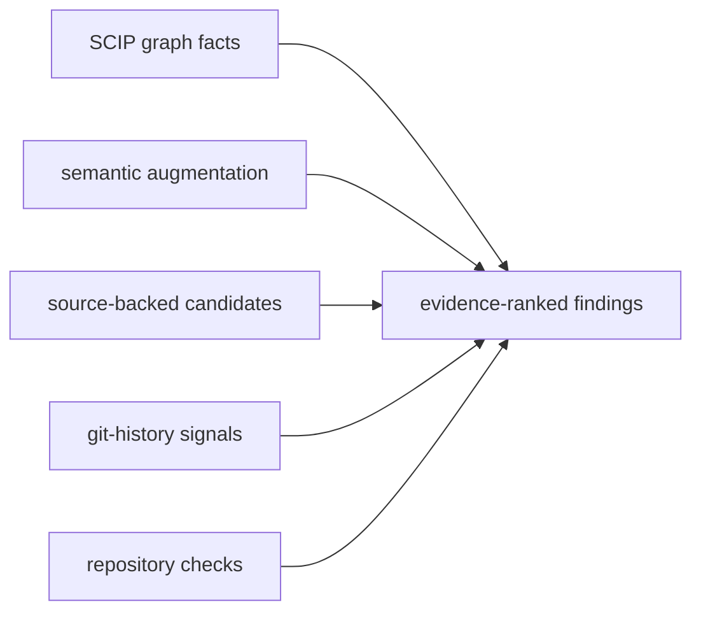

<h1 align="center">
  <picture>
    <source media="(prefers-color-scheme: dark)" srcset="docs/assets/scip-query-logo-dark.svg">
    
  </picture>
</h1>

<p align="center">
  <strong>Evidence and verification for AI coding agents.</strong>
</p>

<p align="center">
  <em>Map the repo. Reuse what exists. Finish the refactor. Gate the diff.</em>
</p>

<p align="center">
  <a href="https://www.npmjs.com/package/scip-query"></a>
  <a href="https://www.npmjs.com/package/scip-query"></a>
  <a href="package.json"></a>
  <a href="https://www.apache.org/licenses/LICENSE-2.0"></a>
</p>

Coding agents operate at too concrete a level of abstraction. They work in files and grep, while every decision that actually matters — does a helper for this already exist, what depends on the thing I'm about to change, is this migration finished or just started — lives one level up, in symbols, references, and history. `scip-query` raises agents to that level: a TypeScript CLI and npm package built on SCIP indexes, git history, language-aware source analysis, and your repository's own checks.

The failure mode it targets is specific. Agents are genuinely good at editing the code in front of them; what they lose is the whole-repository model across a long task. They re-implement helpers they never saw, plan from partial context, migrate three call sites and abandon the other two, miss the file that always changes with the one they touched, and declare a diff finished while it quietly adds duplication, dead code, and docs that now lie. None of that is a syntax error, so nothing stops it — it just accumulates until complexity nukes your development momentum.

So the loop this tool enforces is evidence at every step: map the target and its blast radius, plan from repository facts, check for reuse before adding a concept, detect unfinished migrations and hidden coupling, and gate the finished diff. It does not replace the compiler, tests, or review. The point is to make structural evidence so cheap to ask for that agents actually ask — and to make "done" something the repository gets a vote on.

## How Agents Use It

Two layers, wired by `scip-query setup`:

**Ambient** — no invocation required. Session-start hooks supply index state and routing context; the Stop-hook / pre-commit **diff gate** checks every finished diff for echoes of existing code, unfinished migrations, missing co-change partners, stale doc citations, and new dead code — and feeds findings back to the agent.

**Invoked** — the agent routes work through skills, each carrying its own short command list so it never navigates the full CLI:

| Phase    | Skill                                            | Commands underneath (also usable directly)          |
| -------- | ------------------------------------------------ | --------------------------------------------------- |
| Orient   | `scip-explore`                                   | `system`, `trace`, `plan-context`, `call-graph`     |
| Plan     | `scip-plan`                                      | `plan-context`, `change-surface`, `co-change`       |
| Diagnose | `scip-diagnose`                                  | `trace`, `callers`, `probe-branches`, `diff-impact` |
| Audit    | `scip-audit`                                     | `cleanup-plan --verify`, `dead`, `twin-drift`       |
| Improve  | `scip-improve`                                   | `incomplete-migration`, `recent-duplicates`         |
| Verify   | `scip-verify` (closeout) + the ambient diff gate | `diff-impact`, `diff-gate`, `health --baseline`     |
| Set up   | `scip-setup`                                     | `doctor`, `setup`, `setup-hooks`, `setup-agent`     |

The consolidated skills retain the former specialist lenses as routed
scenarios: API impact and formal/performance planning live in `scip-plan`;
root cause and reachability probes live in `scip-diagnose`; integrity,
maintainability, claim, framework, directory, and twin-drift review live in
`scip-audit`; and cleanup or documentation repair lives in `scip-improve`.
Every command remains directly invocable for humans and scripts.

React and Vue repositories get additional framework-aware checks for repeated component/template structure, hook/composable behavior, and large-component or large-view pressure. These extend the same reuse and completion workflow; the core graph, history, planning, cleanup, and diff-gate commands are not frontend-specific.

## Install

`npm install` only installs the package — it does not touch your home directory, your shell config, or any agent's skill/hook setup. Every write happens explicitly, when you ask for it:

```bash
npm install -g scip-query@latest
scip-query setup           # interactive checklist in a terminal
```

The setup checklist detects the repository's languages and offers to install or
repair the matching SCIP indexers, Tree-sitter AST parsers, agent skills, and
checkout-local hooks. It enables demand-started automatic incremental indexing,
builds the first index, verifies semantic and checker capabilities, and can run
the optional full health audit. Use the arrow keys and Space to change the
selection, then Enter to continue.

For automation, use `scip-query setup --yes` to accept recommended defaults or
`scip-query setup --json` for a non-interactive machine-readable report. Use
`--no-hooks`, `--no-skills`, `--no-parsers`, or `--no-health` only when that
scope is intentionally managed elsewhere. Or run without a global install:
`npx scip-query@latest setup`.

Every public `--json` response identifies its envelope schema, command result
schema, and producing package version. See the
[CLI JSON output contract](docs/CLI_JSON_OUTPUT.md) for the compatibility
policy, decoder API, and machine-readable schema.

Contributors changing exported TypeScript declarations should also follow the
[public API evolution workflow](docs/API_EVOLUTION.md). Its committed manifest
makes every package-subpath signature change explicit before release.

### If npm warns about install scripts

On npm setups with script approval enabled (`allow-scripts`), the install prints warnings like
`15 packages have install scripts not yet covered by allowScripts` — and **skips those scripts**,
which leaves the native modules unbuilt. Every script on that list is expected:

- `scip-query` — its own postinstall (non-fatal by construction: `... || true`)
- `better-sqlite3` — builds/downloads the native SQLite binding that backs the index
- `tree-sitter` + the per-language grammars — native parsers behind multi-language source facts

Approve them and re-run the builds (`--allow-scripts-pending` only _lists_ — the approving forms
are `npm approve-scripts <pkg> ...` or `--all`):

```bash
npm approve-scripts --all        # approve every pending install script (review the list first
                                 # with: npm approve-scripts --allow-scripts-pending)
npm rebuild                      # run the now-approved build scripts
scip-query status --capabilities # verify: languages should show as available
```

This approval is deliberately yours to make — a package cannot approve its own install scripts,
and one that tried would be exactly the kind of supply-chain behavior to distrust.

## Start with One Change

```bash
# Before editing: establish structure, consumers, history, and blast radius
scip-query plan-context <symbol-or-file>

# Before creating a helper or abstraction: look for the existing concept
scip-query similar <closest-symbol>

# After an extraction or migration: find sites that still contain old logic
scip-query incomplete-migration

# Before declaring the work complete: refresh the index and gate the diff
scip-query reindex && scip-query diff-gate --json
```

For a repository-wide cleanup pass:

```bash
scip-query health
scip-query recent-duplicates
scip-query cleanup-plan --verify
scip-query health --write-baseline
```

## Evidence and Confidence

A claim you can't trace to evidence is a vibe. `scip-query` labels every answer with where it came from and how much weight it deserves:



1. **SCIP graph facts** for definitions, references, imports, calls, and dependencies.
2. **Semantic augmentation** for TypeScript where the SCIP index needs more detail.
3. **Source-backed candidates** for similarity, maintainability, and cleanup checks.
4. **Git-history signals** for churn, co-change, recency, and documentation drift.
5. **Repository-toolchain verification** for supported cleanup plans.

Heuristic findings are candidates for inspection, not verdicts — the finding always sounds right, because it was generated to; only the code knows. Run `scip-query capabilities` to see which evidence and verification layers are available for the current repository and language.

## Language and Framework Coverage

Graph navigation works through supported [SCIP](https://github.com/sourcegraph/scip) indexers. Higher-confidence augmentation and verification vary by language and project toolchain. TypeScript currently has the richest semantic augmentation. React and Vue add built-in framework-aware maintainability checks on top of the core workflow.

Rust projects are indexed through rust-analyzer's SCIP output. Compiler-backed
Rust reference, callee, signature, and module/use evidence runs through a
demand-started durable rust-analyzer session with bounded worker fallback.
Capability and status output distinguish indexer readiness, semantic readiness,
the selected transport, and whether the idle helper is currently stopped or
live.

Clojure projects are indexed through `scip-clojure`. Source fallback adds namespace imports, callable/callsite evidence, and protocol/record member evidence for `.clj`, `.cljs`, and `.cljc` files. When the project has `clj-kondo` available, cleanup-plan verification can use `clj-kondo --lint .`. Clojure does not currently have a scip-query semantic provider equivalent to TypeScript's `ts-morph` layer; capability output reports that boundary explicitly.

## Cleaning Up AI-Generated Code

Every check here exists because I watched the failure mode happen — in AI-generated codebases I inherited and rebuilt, and in my own agent sessions. AI-assisted development doesn't rot a codebase in general; it rots it in specific, recurring shapes, and each shape gets its own detector. The full catalog, with prevention wiring for each one, is in [docs/AI_FAILURE_MODES.md](docs/AI_FAILURE_MODES.md):

**1. Find the echoes.** Agents re-implement helpers, hooks, composables, and frontend components they didn't know existed. `recent-duplicates` makes similarity _directional_ using git file ages - which side is the established original, which is the recent echo.

Illustrative output:

```
91%  ECHO  react-component  src/components/ProjectCardVisual.tsx  ProjectCardVisual  (added 62 commits ago)
     duplicates established  src/pages/HomePage.tsx  RecentProjectRow()
     basis: jsx-structure
     shared: component:ProjectCard, prop:title, event:click
100% TWIN  src/workflows/a.ts ensureAccessible() / src/workflows/b.ts ensureAccessible()
     (both new - one agent session duplicated itself; consolidate before they diverge)
```

**2. Finish the half-done extraction.** Agents extract a helper, rewire one or two call sites, and abandon the rest — the extracted logic survives inline at every site they missed. `incomplete-migration` finds helpers that are new in the diff, confirms they were wired in somewhere, and lists the established sites that still contain the helper's logic but never call it (containment scoring, because a missed site holds the helper's logic _plus_ its own).

Illustrative output:

```
src/utils/priceLabel.ts  priceLabel()
  wired into: src/cards/price-summary-a.ts
  un-migrated: 100%  buildReportB()  (src/cards/price-summary-b.ts)
  un-migrated: 100%  buildReportC()  (src/cards/price-summary-c.ts)
```

**3. Catch your standards docs lying.** If you keep in-repo standards for agents to read before implementing, a stale standard is worse than none. `doc-drift` reads every doc's file citations _and_ its co-change history, then flags docs whose code moved on without them — including **broken references** to files that no longer exist:

```
staleness 94  product/domain-model.md
  BROKEN REFERENCE: cites src/api/servicePlans.ts — that file no longer exists
  22 change(s) since doc update  src/workflows/serviceTasks.ts  (referenced by doc)
```

**4. Delete with project checks.** `cleanup-plan` runs dead-code analysis to a _fixpoint_ — deleting batch 0 makes batch 1 dead, and the plan shows the cascade. `--verify` applies each batch in a throwaway git worktree and runs the supported checker detected for your project (differentially, so pre-existing errors don't drown the signal):

```
── Batch 0: deletable now (graph-fact, 67 LOC) ──
── Batch 1: dead once batch 0 lands (cascade, 21 LOC) ──
Batch 0: COMPILER-VERIFIED
```

When verification _fails_, the errors name the exact references the static evidence missed — that failure has caught real detector mistakes and stopped build-breaking deletions.

**5. Trim speculative generality.** `unused-params` finds trailing parameters no body ever uses (the classic "options for later"), scoped to removals that are type-safe by construction.

**6. Keep frontend reuse honest.** React and Vue have dedicated frontend hygiene checks: component-duplicate commands compare JSX/template structure, hook/composable commands compare state/effect/request behavior, and large-component/view commands flag files that concentrate too many reasons to change. `health` includes these as hygiene pressure, while `incomplete-migration` remains the direct check for a hook/composable/helper extraction that was wired into some sites but not all of them.

**7. Surface hidden coupling.** `co-change` finds file pairs that repeatedly change in the same commits with _no_ dependency edge — schema ↔ generated inventory ↔ doc triangles, backend schemas ↔ frontend stores, `.env.example` ↔ its parser. The reference graph cannot see these; the change graph can.

**8. Gate every diff.** `diff-gate` runs a defined set of checks scoped to what a change _introduces_ and exits nonzero with remediation text for each finding. Baseline regressions are included when you pass `--baseline`.

<!-- BEGIN GENERATED DIFF-GATE CHECKS -->

| Check                  | What it catches                                                                                                                   | When it runs                                                                                                                                                                                                                  |
| ---------------------- | --------------------------------------------------------------------------------------------------------------------------------- | ----------------------------------------------------------------------------------------------------------------------------------------------------------------------------------------------------------------------------- |
| `echo`                 | Changed symbols that newly echo established code elsewhere.                                                                       | Default diff gate.                                                                                                                                                                                                            |
| `incomplete-migration` | New helpers or abstractions wired into some sites while older inline sites remain.                                                | Default diff gate.                                                                                                                                                                                                            |
| `co-change-partner`    | Historically coupled files that usually change together but are missing from this diff.                                           | Default diff gate.                                                                                                                                                                                                            |
| `twin-partner`         | A changed symbol has a same-(near-)name twin (identical or already-divergent) elsewhere that this diff left untouched.            | Default diff gate. Advisory: findings print but never cause a nonzero exit by themselves.                                                                                                                                     |
| `coverage-contract`    | A configured `coverageContracts` entry (.scipquery.json) drifted: its declared key set no longer matches its ground-truth source. | Default diff gate, only when either side of a configured contract changed.                                                                                                                                                    |
| `architecture`         | A declared architecture boundary rule has a violation absent from the committed health baseline.                                  | Default diff gate when closed dependency rows, requireCompletePolicy, requireAcyclic, requireResolvedBoundaries, requireMinimalPolicy, maxBoundaryFanOut/maxBoundaryFiles, or testPaths are configured and a baseline exists. |
| `doc-reference`        | Docs that cite changed files and may need a matching update. Dated snapshot docs (docs.snapshotPaths) are excluded by policy.     | Default diff gate. Advisory (21.2) for bare file-mention citations; blocking when the citation has a line anchor or the cited file was deleted/renamed.                                                                       |
| `unused-params`        | Fresh trailing parameters or options that no changed body uses.                                                                   | Default diff gate.                                                                                                                                                                                                            |
| `new-dead`             | Changed production symbols with zero indexed consumers.                                                                           | Default diff gate.                                                                                                                                                                                                            |
| `baseline`             | New health finding identities compared with the committed health baseline.                                                        | Only with `diff-gate --baseline`.                                                                                                                                                                                             |

<!-- END GENERATED DIFF-GATE CHECKS -->

Illustrative output:

```
[co-change-partner] schema.prisma changed, but scripts/scope-inventory.mjs did not — they change together 12x (86% of the time)
  -> Update scripts/scope-inventory.mjs alongside this change, or confirm the coupling no longer holds.
```

**9. Ratchet it in CI.** `health --write-baseline` snapshots finding identities into a committable file; `health --baseline` exits 1 on any _new_ finding. "Don't get worse" is an objective gate that no score arithmetic can game.

**10. Catch byte-identical tiny helpers `similar`'s fingerprints miss.** `duplicate-bodies` normalizes and hashes small callable bodies (comments/whitespace stripped, default `--min-loc 3`) and reports exact matches spanning multiple files — the "escapeRegex copy-pasted into seven files" shape that shape-based similarity scoring is too coarse to flag.

**11. Catch a same-name function that drifted apart.** `twin-drift` finds functions with the same (or near-same) name in different files whose bodies have diverged — a strong signal one side got a bug fix, edge case, or feature the other never received. Synthetic leaves and test-only groups are excluded by default.

Baseline finding identities are keyed as `detector:file:shortName`. A rename can therefore appear as one fixed identity plus one new identity; refresh the baseline after intentional renames once the changed code has been reviewed.

Accepted findings can be recorded without weakening the rest of the gate:

```bash
scip-query suppress SQABC123DEF456 --check echo --reason "intentional compatibility shim"
```

This writes one file per suppression under `.scipquery/suppressions/` — commit it with your change. One-file-per-suppression means two branches suppressing different findings merge without conflict; the legacy `suppressions[]` array in `.scipquery.json` is still honored (read-only). Every suppression requires a reason plus either a stable finding id or a `check` (optionally narrowed by `file`). Check+file suppressions are allowed but warn because they waive every matching finding in that file. `diff-gate --json` reports both active and suppressed findings.

The first suppression for an identity is created exclusively. Repeating the
same decision is idempotent, but a different reason, expiry, check, or file is
a policy change and never silently overwrites the existing file. The command
reports the existing SHA-256 revision:

```text
error: A different suppression decision already exists at ...
Current revision: 0123456789abcdef0123456789abcdef0123456789abcdef0123456789abcdef.
```

After reviewing the committed decision, replace exactly that revision:

```bash
scip-query suppress SQABC123DEF456 --check echo \
  --reason "superseded by a narrower compatibility exception" \
  --replace 0123456789abcdef0123456789abcdef0123456789abcdef0123456789abcdef
```

If another writer changes the record first, the stale replacement is rejected
and the newer bytes remain intact. New records declare their schema version,
stable suppression identity, and writer version. Older unversioned records
remain readable and are upgraded only by an explicit replacement.

**12. Measure whether the gate is earning its keep.** Every completed `diff-gate` run, including JSON and installed Stop-hook runs, writes each finding transition to its own committed `.scipquery/events/*.json` file. Independent branches add independent paths instead of editing one shared ledger file, so ordinary event writes do not create merge conflicts. Each event stores the immutable Git commit used as its comparison base. A finding is a verified fix when it disappears under that same comparison—either directly or after scip-query cleanly replays the original base against a newer committed `HEAD`. Merely committing the finding cannot clear it: if replay still finds it, the outcome stays open; if the worktree is dirty or Git cannot reproduce the base, verification waits. A suppressed finding was noise or an accepted trade-off:

```bash
scip-query effectiveness --since 30d
```

```
check       caught  fixed  suppressed  open  moved  unverified  precision  median-days-to-fix
echo        14      10     2           1     0      1           83%        0.8
new-dead    6       5      0           1     0      0           100%       0.3
```

`precision` is verified fixed ÷ (verified fixed + suppressed). `moved` separates rename churn, while `unverified` is reserved for legacy or otherwise non-comparable resolutions that lack replay proof. Run diff-gate once to record the finding and again after the repair; a pre-commit rerun uses the same base directly, while a clean post-commit run automatically replays the stored base. Filter with `--check <name>`, window with `--since 30d|12w|<ISO date>`, and get machine-readable output with `--json`. Because the event files are committed, the numbers survive re-clones and aggregate across every machine and agent working the repo. Legacy `.scipquery/ledger/events.jsonl` records remain readable and are migrated to individual files on the next gate write. Historical cross-`HEAD` events without stored comparison evidence remain unverified rather than being reclassified speculatively. Standalone health/cleanup commands are not yet outcome-tracked because they do not all expose a complete-scan contract.

The health report also keeps a worktree-local repeat counter in `evidence.db`.
A logical observation is one completed detector evaluation named by an
observation ID; unlike a process attempt, a retry of that evaluation reuses the
same ID. SQLite serializes these observations before deriving their
transitions. Two different IDs that report the same finding therefore add two
to `timesShown`, while an exact retry with the same ID and evidence adds
nothing. Reusing an ID for different evidence is rejected and reported. A
writer-lock timeout skips the local counter update rather than delaying or
changing the gate decision, and the next distinct run may try again. The
dedupe records live as long as that rebuildable `evidence.db`; deleting the
database resets both the counters and their retry memory. These local counters
feed detector-precision hints, not the committed `effectiveness` totals above.

Before any edit, `plan-context <target>` bundles the structural picture — definitions, references, call graph, blast radius — plus a HISTORY section: churn, fix-commit density, and the files that usually change together with the target ("editing this usually means editing these").

## A Health Score You Can Argue With

`scip-query health` refuses to be a vanity number.

Illustrative output:

```
Codebase Health Score: 95/100
  Risk:    95/100  (history-correlated signals: graph facts + change graph)
  Hygiene: 100/100 (tidiness candidates)

Score Breakdown (100 minus the following):
  - 5  hidden-coupling: 5 co-changing pair(s) without a dependency edge

Axes:
  Deletable:            1,027 LOC across 89 symbols
  Change amplification: 5 files/commit median, 23 p90
  Evidence quality:     5 graph-fact, 150 heuristic, 0 user-suppressed
  Validation:           flagged fix-density 0.12 vs baseline 0.20 (0.6x)
```

- **Risk vs. Hygiene** are separate claims: risk components are tied to graph facts and repository-history signals; hygiene components are tidiness. Blending them is how scores become meaningless.
- **Every deduction is itemized** — the scalar is auditable, not vibes.
- **The validation axis is a falsifiability loop**: it measures whether flagged files actually attract more fix commits than the rest _in your repo_, per detector. On some codebases a detector tracks repeated fixes; on others it is mostly noise — the tool reports which, instead of assuming.
- **Suppressions are data**: every `// scip-query: ignore-*` comment is a precision label, counted and reported.

## Accuracy Model

Evidence tiers are kept explicit, strongest first:

1. **Compiler-backed facts** from the SCIP database (`trace`, `refs`, `deps`, `outline`, ...).
2. **Semantic augmentation** via `ts-morph` for TypeScript — verified references, callers, callees when SCIP alone is incomplete.
3. **Source-backed heuristics** (AST/text) for cleanup signals. Always labeled: _"these are candidates, not exact compiler facts."_
4. **Compiler verification** for deletions — the only tier that earns the word "safe."

And because accuracy you don't measure is a feeling, `self-audit` samples symbols and scores the cheap paths against the TypeScript compiler.

Illustrative output:

```
references  precision 1.0  recall 0.9   (the cheap path doesn't fabricate; it occasionally misses)
```

Heuristic detectors carry guardrails learned from real codebases: published `package.json` surfaces are exempt from "unused" advice, `contracts/` and `types/` modules are exempt from "definer never uses it," test files and component-sibling files don't count as hidden coupling, and changelogs-by-policy aren't drift.

## Agent Skills

`scip-query install-skills` symlinks bundled skills into Claude Code, Codex, and shared agent roots (`~/.agents/skills/`) so they update automatically with the package. The `scip-query` router skill dispatches codebase work to the specialist below; when unsure which owns a task, start there.

### Bundled skills

One-line "essential difference" per skill — read this table before the Routes table in `skills/scip-query/SKILL.md` if two names sound alike.

| Skill           | Essential difference                                                           |
| --------------- | ------------------------------------------------------------------------------ |
| `scip-query`    | Router: select the smallest workflow that answers the request.                 |
| `scip-explore`  | Understand or diagram existing code without changing it.                       |
| `scip-plan`     | Prove the blast radius and specify one change or a multi-phase program.        |
| `scip-diagnose` | Trace a failure, recurring design flaw, issue, or unreachable branch to cause. |
| `scip-audit`    | Classify integrity, maintainability, drift, framework, and cleanup evidence.   |
| `scip-improve`  | Act on confirmed audit or documentation findings and ratchet the result.       |
| `scip-verify`   | Test and challenge a finished change before declaring it complete.             |
| `scip-setup`    | Adopt or repair scip-query in a repository.                                    |
| `_shared`       | Manual-only command/evidence reference loaded by another workflow when needed. |

The important boundary is read-only versus mutating work: `scip-audit`
classifies current evidence, while `scip-improve` changes confirmed findings.
`scip-plan` is prospective evidence before implementation; `scip-verify`
challenges a concrete finished diff. `scip-explore` explains working behavior;
`scip-diagnose` starts from a failure or contradiction.

Project setup writes reviewable checkout-local lifecycle hooks for Codex and Claude Code (`.codex/hooks.json` and `.claude/settings.local.json`). A checkout-local hook is an agent-tool preference whose defining trait is that it applies to one clone rather than expressing team policy. Setup adds both paths to that clone's `.git/info/exclude`, so they do not appear in commits, and refuses to rewrite either path if it is already tracked. `setup-hooks --shared` remains accepted only as a deprecated compatibility flag; it no longer writes `.claude/settings.json`. These hooks add scip-query context at session start, route prompts toward the right skill, and run an advisory Stop-hook wrapper around the diff gate only for that repository. The Stop hook sends feedback to the agent by default instead of blocking; set `SCIP_QUERY_STOP_HOOK_MODE=warn` for a warning-only hook response, or `SCIP_QUERY_STOP_HOOK_MODE=block` to enforce the gate. Set `SCIP_QUERY_SKIP_HOOK_INSTALL=1` or run `scip-query setup --no-hooks` to skip hook installation during setup, and run `scip-query setup-hooks --json` later to repair the current checkout's hooks.

Setup/configuration writers are conflict-aware. They reread the latest file
under a short token-owned lock, preserve unknown JSON fields and prose outside
owned Markdown markers, and publish complete bytes durably. An unrelated
intervening JSON edit is merged; a stale decision about the same project-config
field, malformed latest JSON, malformed managed markers, or an edit that wins
the final revision check produces an explicit conflict and leaves the latest
file untouched. Reload the file and rerun the command after resolving that
conflict. See [Configuration and setup write safety](docs/CONFIGURATION_WRITE_SAFETY.md).

For a project, run `scip-query setup`. It enables demand-started automatic
indexing unless the project already has an explicit `watch.enabled: false`,
starts or reuses the project service, verifies its clean-idle deadline, and
reports Rust's final durable/worker semantic selection and lifecycle state.
The status read is passive; the setup health audit may make a semantic request
that wakes rust-analyzer, after which the helper exits on clean idle.
It also installs/refreshes skills, configures project-local hooks unless
skipped, checks indexer readiness, attempts configured indexer remediation,
refreshes the index, smoke-tests representative command families, writes
`docs/scip-query/health-dossier.md` and `.json` when the optional health pass is
selected, reports the health score and items needing attention, and seeds
AGENTS.md/CLAUDE.md guidance. Use
the default terminal checklist to accept or decline the recommended automatic
indexing action and other project-local changes (`--guided` reopens it
explicitly). After setup,
`scip-audit` confirms raw signals and `scip-improve` keeps
fixing the worst confirmed items until no safe confirmed cleanup remains. Use
`scip-query setup --git-hook` when you also want a local pre-commit diff gate.
CI setup is intentionally separate.

Setup classifies every change by where its facts belong:

- **Repository records (commit):** shared project policy and history whose value comes from surviving clones and branches, including `.scipquery.json`, AGENTS/CLAUDE guidance, health dossiers, `.scipquery/suppressions/*.json`, and `.scipquery/ledger/`.
- **Checkout preferences (do not commit):** integration settings for one clone, including `.codex/hooks.json`, `.claude/settings.local.json`, `.git/info/exclude`, and an optional `.git/hooks/pre-commit` backstop.
- **User environment:** installed skills and language indexers used across checkouts on that machine.

Rebuildable indexes, caches, and service state are runtime state: generated working data whose defining trait is that source plus configuration can reproduce it. They remain outside the repository by default. `setup --guided` labels each question with its scope, and both human and JSON setup reports return the resulting scope buckets.

## Formal Models (TLA+)

For the parts of a system where the risk lives in interleaving — retries, concurrency, partial failure, money, a state machine with guards — `scip-query` scaffolds a TLA+ model tied to indexed code and keeps it honest against that code:

```bash
scip-query tla scaffold src/queue/store.ts          # draft spec + config + mapping from indexed code
scip-query tla verify specs/queue/Queue.tla          # mechanical conformance: referents, reads/writes, calls, model checker
scip-query tla instrument specs/queue/Queue.tla      # generate a trace recorder + wiring sites for each mapped action
scip-query tla trace-check specs/queue/Queue.tla --trace traces/run1.json   # check a recorded execution against Next
scip-query tla fetch-tools                           # download the pinned tla2tools.jar into the cache
```

`tla verify` checks the mapping contract against the model text and the indexed code: variable and action referents must resolve to value-like symbols (not types), declared reads/writes are checked against a static scan, and every waiver requires a reason and is counted in the output. At scale, findings are grouped by `(category, modelElement)` with up to 3 exemplars per group by default — pass `--full` to print every finding ungrouped. The `scip-plan` formal-model scenario (`scip-query install-skills`) walks the scaffold → verify → instrument → trace-check loop end to end.

`tla fetch-tools` allows five minutes and 256 MiB for the pinned download by
default. It streams bytes through the SHA-256 verifier instead of buffering the
response, rejects malformed or oversized `Content-Length`, and enforces the
same ceiling when the header is absent. Callers for one cache path serialize on
a token-owned lock and recheck the winner's checksum before fetching. Failed,
aborted, or competing operations remove only their random-token staging file;
the previously accepted cache remains available. Successful promotion flushes
the verified file and its containing directory before acknowledging the new
cache where the platform supports directory sync.

File-backed state uses an explicit visibility-versus-crash-durability
classification. See [Filesystem Publication and Durability](docs/DURABILITY.md)
for the guarantees, failure outcomes, Windows limitation, and call-site matrix.
Process coordination uses one versioned, token-owned format with conservative
malformed-file recovery; see
[Process Lock Ownership and Recovery](docs/LOCK_PROTOCOL.md).

## Quick Start

```bash
scip-query setup             # interactive: languages, indexers, parsers, hooks, indexing, capabilities
scip-query status --capabilities

scip-query stats
scip-query system src/auth
scip-query plan-context login
scip-query diff-impact --json
scip-query health --json
scip-query cleanup-plan --verify
scip-query health --write-baseline   # start the ratchet
```

## Prerequisites

- Node.js >= 18
- `scip` CLI, from [Sourcegraph SCIP releases](https://github.com/sourcegraph/scip/releases)
- A language-specific SCIP indexer for your project

On Windows, the `scip` binary is installed automatically from npm: `scip-query-scip-windows` is an os-gated optional dependency (universal package, x64 + arm64) that only Windows installs fetch. Resolution order: `scip` on PATH, then `SCIP_QUERY_SCIP_BIN`, then the sidecar package. Run `scip-query check-deps` for platform-specific install instructions.

| Language                      | Indexer          | Install                                                                                                                       |
| ----------------------------- | ---------------- | ----------------------------------------------------------------------------------------------------------------------------- |
| TypeScript / JavaScript / Vue | scip-typescript  | `npm install -g @sourcegraph/scip-typescript`                                                                                 |
| Java / Scala / Kotlin         | scip-java        | [releases](https://github.com/sourcegraph/scip-java/releases)                                                                 |
| Rust                          | rust-analyzer    | Ships with rust-analyzer: `rust-analyzer scip`                                                                                |
| Python                        | scip-python-plus | `npm install -g scip-python-plus`                                                                                             |
| Go                            | scip-go          | `go install github.com/sourcegraph/scip-go@latest`                                                                            |
| Ruby                          | scip-ruby        | [releases](https://github.com/sourcegraph/scip-ruby/releases)                                                                 |
| C / C++                       | scip-clang       | [releases](https://github.com/sourcegraph/scip-clang/releases)                                                                |
| C# / VB                       | scip-dotnet      | [releases](https://github.com/sourcegraph/scip-dotnet/releases)                                                               |
| Dart                          | scip-dart        | [releases](https://github.com/Workiva/scip-dart/releases) or `dart pub global activate scip_dart`                             |
| PHP                           | scip-php         | [releases](https://github.com/davidrjenni/scip-php/releases) or Composer package `davidrjenni/scip-php`                       |
| Clojure / ClojureScript       | scip-clojure     | Requires a `scip-clojure` binary on PATH; source: [PlunderStruck/scip-clojure](https://github.com/PlunderStruck/scip-clojure) |

For Python, the executable may be `scip-python`, `scip-python-plus`, or both. `scip-query` accepts either name.

Vue single-file components are handled through the JavaScript/TypeScript indexer. `scip-query` also extracts the `<script>` or `<script setup>` block so symbol, reference, and import queries cover Vue components alongside regular `.ts` and `.js` files.

`augment-vue` uses one in-process Volar context by default. Calibrated projects
can opt into parallel computation with `SCIP_QUERY_AUGMENT_VUE_WORKERS=<count>`.
The CLI then owns every worker until exit: a timeout or peer failure terminates
and awaits all unfinished workers before removing their private result
directory. `SCIP_QUERY_AUGMENT_VUE_WORKER_TIMEOUT_MS` defaults to five minutes,
and `SCIP_QUERY_AUGMENT_VUE_WORKER_RESULT_MAX_BYTES` defaults to 64 MiB per
worker. Every result carries its run, worker, and task identities and is
size-checked before parsing, so a stale, partial, or mismatched result cannot
enter the deterministic worker-order merge.

`scip-query capabilities` prints project-level readiness plus a per-language matrix for SCIP indexing, source fallback evidence, semantic provider support, cleanup detector support, and cleanup verification coverage. Use it when you need to know whether a finding is graph-backed, semantic, heuristic, or compiler-verified for the language in front of you.

## How It Works

1. A SCIP indexer analyzes source code with the actual compiler, type checker, or language server and produces `index.scip`.
2. The `scip` CLI converts that protobuf file to a SQLite database: `index.db`.
3. `scip-query` runs SQL queries, language-aware source augmentation, and git-history analysis against it.

By default, indexes live in `~/.cache/scip-query/projects/<hash>/`, keeping project directories clean. Override paths with `.scipquery.json` or `SCIP_QUERY_*` environment variables. Reindexing writes per-language SCIP shards next to the SQLite index, so a mixed-language repo can reuse unchanged language outputs and rerun only the languages whose source/config inputs changed.

Each accepted worktree-local index is also stored beneath an immutable
`.scipquery-generations/<identity>/` directory. An atomic `state.json` pointer
selects the database, SCIP companion, and metadata as one unit; every
`ScipDatabase` retains that unit for its lifetime. The familiar top-level
`index.db`, `index.scip`, and `meta.json` files remain compatibility mirrors,
but internal queries do not reread them after opening a generation. This keeps
cursor identities and semantic requests attached to the same rows even during
a concurrent reindex. The publication, crash, legacy-overlap, and retention
rules are documented in [Local Index Generations](docs/INDEX_GENERATIONS.md).

All `meta.json` consumers share one version decoder and an explicit capability
matrix. Version 2 remains readable, version 3 is current, and version 4 is a
reserved unsupported migration boundary. See
[Reindex Metadata Compatibility](docs/REINDEX_METADATA_COMPATIBILITY.md).

Git worktrees in the same repository also share immutable generations under
`~/.cache/scip-query/repositories/<repository-id>/`. A shared generation is a
complete index for one exact committed tree, indexing configuration, artifact
schema, and scip-query producer version; its immutability lets several
worktrees trust it without sharing later writes.
Before an index-reading command opens SQLite, a clean worktree with an exact
generation clones it into that worktree's normal writable cache. Filesystem
copy-on-write cloning is used when available, with an ordinary copy fallback;
hard links are never used. Dirty edits, watcher refreshes, locks, and local
`evidence.db` state therefore remain private to the worktree.

Each worktree lease names the exact shared generation protected from
collection. Lease publication, liveness touches, and repository cleanup share
one repository-cache lock. A touch rereads the current lease only after
acquiring that lock, validates its ownership checksum and current local
generation, and changes only `lastSeenAt`. If a newer generation was attached,
the lease was deleted or recreated, or its ownership changed while the touch
waited, the touch preserves that current state instead of replaying its stale
observation.

Automatic refresh follows the same boundary. When `watch.enabled` is true,
the first watcher-eligible command in each worktree starts or reuses a daemon
identified by that checkout's Git worktree ID. A Git worktree ID is a checkout
identifier derived from its filesystem path after symbolic-link redirects are
resolved and its checkout-specific Git control directory; that combination
distinguishes sibling worktrees even though they share repository objects. The
daemon observes only that worktree's files and Git index, and every reindex
child writes only to that worktree's writable `index.scip` and `index.db`. A
cross-platform source watcher maintains the directory subscriptions needed to
detect ordinary unstaged edits even when Node does not provide recursive
filesystem events, while separate Git polling detects commit and staging-state
changes. File events that arrive during a reindex still mark the watcher dirty,
but the queued rerun is suppressed when the completed index's source
fingerprint proves those events are already represented; a stale or unreadable
fingerprint always preserves the rerun. If the host refuses an event-backed
subscription because its open-file allowance is exhausted, that project
retries with 500 ms file polling; ordinary event-backed watchers do not pay
that polling cost. A
shared generation is only a warm starting snapshot; it never implies a shared
watcher or shared later writes. A daemon that exits after its configured idle
timeout starts warm again when that worktree is next used.

Command-triggered refresh intent is stored separately from disposable activity
timestamps. Each accepted demand is an immutable request with a deadline and
optional idempotency key; the daemon claims pending requests exclusively,
coalesces them deliberately, and acknowledges them only after the corresponding
reindex completes. A failed attempt returns its requests to pending, and a
successor daemon recovers claims left by a crashed owner. `watch --status`
reports pending, claimed, completed, and expired counts. The complete
at-least-once and retention contract is documented in
[Watch Refresh Requests](docs/WATCH_REFRESH_REQUESTS.md).

The primary checkout is only a possible source of a generation, never an
authority for a linked worktree. If its local cache already contains
uncommitted changes that are absent from a new worktree's `HEAD`, the full
source fingerprint differs and that cache is rejected. The new worktree uses
an existing immutable generation for its own `HEAD` or performs the one clean
build that creates it.

The same behavior applies whether a worktree was created by Git, Conductor, or
an agent. Concurrent cold worktrees at one snapshot coordinate one shared
publication. A removed managed worktree cache is deleted by the next
opportunistic sweep after its watcher, hydration, and index-build processes
have exited; a shared generation stays while a live worktree or process
references it, then remains for one unreferenced hour unless the 2 GiB
repository budget requires earlier eviction. Ownership checksums and physical
path containment prevent cleanup from following forged records or symlinks.
Explicit `dbPath`, `SCIP_QUERY_CACHE_DIR`, and
`SCIP_QUERY_INDEX_DB` locations are never shared or automatically deleted.
Those explicit overrides also bypass default path isolation, so pointing two
worktrees at the same mutable override is intentionally outside automatic
per-worktree protection.
Set `SCIP_QUERY_SHARED_CACHE=0` to restore worktree-local-only behavior.

Each rebuilt generation also records an affected-set shadow beside the index:
the files a future incremental writer would recompute, the normalized
documents/facts that the authoritative full rebuild actually changed, recall,
and any conservative fallback reason. `scip-query status` shows a compact
summary and telemetry path; `status --json` exposes the structured
`affectedSetShadow` object. Shadow results are observational in this phase and
never decide which indexer runs or which generation publishes.
Historical shadow rows are compact calibration summaries. They rotate at
8 MiB and retain one previous segment, bounding history near 16 MiB per
project; the complete latest record remains available for status diagnostics.
After acquiring a project's exclusive reindex lock, each reindex also removes
staging directories abandoned by interrupted earlier reindexes.
Watch and watcher-triggered reindex ownership records include the operating
system process start identity as well as the PID. `watch stop`, daemon
replacement, and manual preemption verify both values before signaling. A
legacy record or a platform lookup failure therefore fails closed with an
explicit recovery error instead of treating a reused PID as the old
tool-owned process.

Finite subprocesses use explicit wall-time and output budgets. Quick binary
probes default to 10 seconds, Git operations to 30 seconds, isolated analysis
workers to 180 seconds, installers and index conversion to 300 seconds, and
language indexers to 600 seconds. Set `SCIP_QUERY_INDEXER_TIMEOUT_MS` to a
positive integer to override the indexer deadline. Command-specific checker,
TLA+, benchmark, and Rust semantic budgets continue to use their documented
options or environment settings. When an asynchronous finite child exceeds
its deadline or output budget, scip-query drains both streams, sends `TERM`,
escalates to `KILL` after a one-second grace period only while the recorded
process identity still matches, and reports completion only after the child
has closed. Detached watch and semantic services are deliberate exceptions:
their persisted identity, lease, request deadlines, and stop protocol own
their lifetime.

TypeScript monorepos can opt into project sharding with `indexer.typescript.projectMode: "workspace"`. In that mode, `scip-query` discovers repo-local TypeScript project roots, runs one `scip-typescript` process per project with bounded concurrency, merges the shard protobufs, and still publishes one TypeScript language index. Set `indexer.typescript.projects` to an explicit list of project directories or tsconfig paths when automatic discovery is too broad. When `projects` is set to a non-empty list, it is authoritative: only the listed projects are indexed, automatic discovery does not run, and the repo root is not re-added alongside them (even if the root tsconfig covers subdirectories) — files that are only covered by an excluded root tsconfig (e.g. shared ambient `.d.ts` files) drop out of the index, so pick the list deliberately. An empty or absent `projects` falls back to full discovery, unchanged. Workspace mode also caches each project shard: reindexing after an edit reruns only the changed projects and their dependents (workspace `package.json` dependencies and tsconfig `paths`/`references` targets count as dependencies), serves untouched projects from `language-indexes/typescript-projects/`, and reports every reuse decision in `reindex --json` shard diagnostics. Set `indexerConcurrency` when a repo needs a persistent worker cap; CLI `--indexer-concurrency` and `SCIP_QUERY_INDEXER_CONCURRENCY` still override ad hoc runs.
Use `indexer.typescript.pnpmWorkspaces` only with the default single-project mode; workspace mode passes explicit projects instead.

Do not enable workspace mode merely because a repository uses TypeScript. Use
it when the repository has multiple real tsconfig/project boundaries and the
setup/readiness evidence confirms them. Single-project repositories already
reuse unchanged TypeScript documents and keep a persistent ts-morph Project in
the demand-started service.

Clojure projects can pass a project-local `scip-clojure` config file through `.scipquery.json`:

```json
{
  "languages": ["clojure"],
  "indexer": {
    "clojure": {
      "configPath": ".scip-clojure.json"
    }
  }
}
```

Most read-only commands accept `--json` and use the same envelope:

```json
{ "command": "fan-in", "args": ["login"], "options": { "json": true }, "result": [] }
```

## Configuration

Run this in a project root:

```bash
scip-query init
```

It creates a minimal `.scipquery.json`:

```json
{
  "languages": ["typescript"],
  "watch": {
    "enabled": true,
    "debounceMs": 250,
    "cooldownMs": 0,
    "gitPollMs": 2000,
    "idleTimeoutMs": 600000,
    "autoRefresh": true
  }
}
```

Creation is exclusive: if another process creates `.scipquery.json` first,
`init` preserves that complete file rather than replacing it.

Add optional fields such as `indexerConcurrency`, `indexer`, `entryRoots`,
`declaredCouplings`, and `suppressions` only when the project needs them.

`scip-query init` and a first `scip-query setup` enable this lifecycle. An
existing explicit `watch.enabled: false` remains an opt-out unless guided setup
selects the recommended enable action. With `watch.enabled`, normal commands
and agent hooks wake one per-project
background service. Relevant file/Git activity keeps it alive; it exits after
`idleTimeoutMs` of clean inactivity and wakes on the next command. Set the idle
timeout to `0` to keep it running. `scip-query watch` still provides foreground
mode, while `watch --daemon`, `watch --status`, and `watch --stop` expose the
background lifecycle. Both modes share one project lock, so only one can own an
index cache. Stopping is an asynchronous drain: the watcher first rejects new
refreshes, continuously consumes a bounded tail of the active worker's output,
closes every source subscription, and waits for the worker to exit after
`TERM`/`KILL` escalation before it removes service state or releases the lock.
`watch --status` reports `Stopping safely` while that work is in progress. If a
subscription cannot close or worker exit cannot be established, the service
keeps an explicit degraded draining record and its ownership files instead of
advertising a clean stop; the reported reason is the recovery evidence.
Elapsed waits and idle control use a process-local monotonic clock; shared
heartbeats remain civil-time diagnostics and never authorize replacement or a
process signal by age alone. See [Time Semantics](docs/TIME_SEMANTICS.md).

The same demand-started service lazily owns TypeScript compiler Projects after
the first command that needs ts-morph semantics. Separate CLI processes reuse
that session through a repository-local bounded mailbox; source-only index
generations refresh the existing Projects, while configuration or uncertain
changes replace them. `watch --status` reports Project/session/request counts.
Current TypeScript and durable Rust mailbox operations use stable
content-derived identities, pending/inflight/response states, atomic
owner-expiring claims, retained idempotent completions, FIFO enqueue ordering,
typed item/byte backpressure, bounded cleanup, and pressure telemetry. Client
timeout or exit no longer deletes shared work; a service crash before response
is reclaimable, while a response published before a crash prevents
re-execution. The precise state machine, default limits, legacy overlap, and
failure matrix are documented in
[`docs/MAILBOX_LIFECYCLE.md`](docs/MAILBOX_LIFECYCLE.md).
It also reports a rolling 24-hour reindex activity summary: rebuilt, reused,
failed, and freshness-proven suppressed refreshes plus estimated logical output
bytes. The estimate counts scip-query artifacts emitted by rebuilt refreshes;
it is not a measurement of physical SSD writes. The underlying
`reindex-activity.jsonl` history uses two bounded 1 MiB segments. Append,
rotation, and retained-set reads share a process-instance lock; incomplete
crash tails are trimmed or ignored without deleting earlier complete lines.
These observations are process-visible rather than crash-durable. See
[`docs/TELEMETRY_RETENTION.md`](docs/TELEMETRY_RETENTION.md).
The refresh-request counters reported beside it describe durable demand
admission and processing state, not reindex frequency.
If the service is stopped, incompatible, busy beyond its bound, or returns an
invalid response, the command falls back to the existing in-process ts-morph
provider.

Rust semantic requests use a separate demand-started durable rust-analyzer
session by default. It remains stopped until a Rust semantic request needs it,
exits after its clean idle period, and automatically falls back to the
per-command worker on helper/readiness/timeout/request failure. Set
`SCIP_RUST_SEMANTIC_DURABLE_SESSION=0` for an explicit worker-only opt-out.
The LSP transport accepts at most a 16 KiB response header and a 64 MiB JSON
message by default, with a 64 KiB header ceiling and a 256 MiB combined
wire-buffer ceiling even for programmatic overrides. Missing, invalid,
duplicate, unsafe, or oversized `Content-Length` framing kills that transport
once, clears its retained bytes, and fails all outstanding semantic/readiness
work so the normal worker or graph/source fallback can take over.

Use `declaredCouplings` for files that intentionally form one maintenance unit.
These pairs are treated as structurally linked by `co-change` and health, while
still appearing in file-specific exploration. The cleanup detector example
keeps dead-code, isolated-callable, and stale-abstraction detectors together
because they share candidate and evidence policy changes:

```json
{
  "declaredCouplings": [
    {
      "name": "cleanup detector family",
      "reason": "These detectors share candidate, evidence, and health policy changes.",
      "files": [
        "src/queries/cleanup/dead.ts",
        "src/queries/cleanup/isolated.ts",
        "src/queries/cleanup/stale-abstractions.ts"
      ]
    }
  ]
}
```

The consumer evidence product migration kept this declared-coupling example
current: `src/queries/cleanup/stale-abstractions.ts` still belongs to the
cleanup detector family and still shares candidate/evidence policy with the
dead and isolated cleanup detectors.

Useful environment variables:

| Variable                  | Purpose                                                                 |
| ------------------------- | ----------------------------------------------------------------------- |
| `SCIP_QUERY_PROJECT_ROOT` | Override the project root directory                                     |
| `SCIP_QUERY_INDEX_DB`     | Override the SQLite database path and bypass automatic worktree sharing |
| `SCIP_QUERY_INDEX_SCIP`   | Override the SCIP protobuf path                                         |
| `SCIP_QUERY_CACHE_DIR`    | Override the cache directory and bypass automatic worktree sharing      |
| `SCIP_QUERY_SHARED_CACHE` | Set to `0` to disable shared generations, evidence, leases, and cleanup |
| `SCIP_QUERY_SCIP_BIN`     | Path to a local `scip` binary (overrides PATH and the Windows sidecar)  |

Query results are filtered through the project's `.gitignore`. If none exists, common generated directories such as `dist/`, `target/`, `node_modules/`, and `.venv/` are excluded by default.

## Documentation

- [AI Failure Modes](docs/AI_FAILURE_MODES.md): every specific way AI coding rots a codebase, the detector built for it, and how to wire prevention in.
- [Detector Guide](docs/DETECTOR_GUIDE.md): what each detector measures, the differences between the confusable ones, and which check to run after which kind of change.
- [Agent Guide](docs/AGENT_GUIDE.md): goal-oriented workflows for tracing, planning, cleanup, quality checks, and change verification.
- [Command Reference](docs/COMMAND_REFERENCE.md): generated command syntax, descriptions, and options.
- [CLI JSON output contract](docs/CLI_JSON_OUTPUT.md): versioned envelopes, compatibility rules, and schema.
- [Programmatic API](docs/API.md): using the query functions from TypeScript.
- [Historical plans](https://github.com/PlunderStruck/scip-query/tree/main/docs/plans): implementation notes and completed cleanup plans.

## License

Apache-2.0
