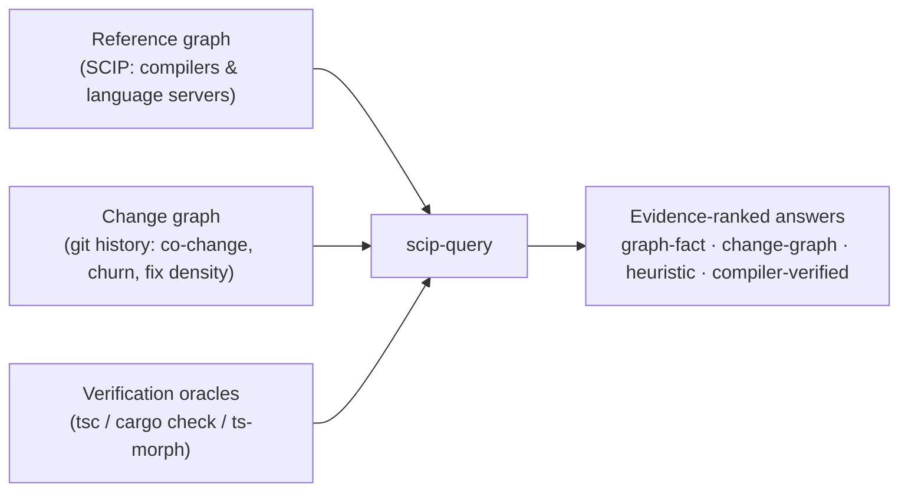

<p align="center">
  
</p>

<h1 align="center">scip-query</h1>

<p align="center">
  <strong>Structural code intelligence for AI agents and engineers.</strong>
</p>

<p align="center">
  Ask compiler-backed questions about how a codebase is wired together, find what's rotting, and delete it with a compiler proof in hand.
</p>

<p align="center">
  <a href="https://www.npmjs.com/package/scip-query"></a>
  <a href="https://www.npmjs.com/package/scip-query"></a>
  <a href="package.json"></a>
  <a href="https://www.apache.org/licenses/LICENSE-2.0"></a>
</p>

<p align="center">
  <a href="https://www.npmjs.com/package/scip-query"></a>
  <a href="docs/AGENT_GUIDE.md"></a>
  <a href="docs/COMMAND_REFERENCE.md"></a>
</p>

`scip-query` answers precise questions about how a codebase is wired together — where a symbol is defined, who references it, what calls it, what breaks if it changes — and turns those answers into something rarer: **cleanup you can trust**. Findings are ranked by evidence quality, validated against your repo's own git history, and (for deletions) proven safe by your own compiler before you touch anything.

Works with every language that has a [SCIP](https://github.com/sourcegraph/scip) indexer: TypeScript, JavaScript, Vue, Java, Scala, Kotlin, Rust, Python, Ruby, Go, C/C++, C#, Visual Basic, Dart, PHP.

## Install

```bash
npm install -g scip-query@latest
scip-query reindex          # index the current project
scip-query health           # see where you stand
```

Or without a global install: `npx scip-query@latest reindex`.

## The Problem

Two problems, actually.

**Agents lose the thread.** A codebase is files connected by definitions, references, imports, calls, and dependency paths. Reading files gives local text, not verified structure. Search finds matching words, not real references. Before editing one unit you need to know what it is, who uses it, and what depends on it — with evidence, not vibes.

**AI-generated code rots in specific ways.** Agents re-implement helpers they didn't know existed. They leave parallel half-wired implementations behind. They add parameters and options "for later" that never come. And the standards docs you write *for* them drift away from the code — so the next agent implements against a dead spec. Generic linters don't see any of this, because none of it is visible in a single file.

`scip-query` attacks both: structural questions with evidence-backed answers, and rot detectors tuned to how code actually decays — each one validated, and each one honest about its own confidence.

## Three Sources of Evidence

Most code tools have one lens. `scip-query` has three, and tells you which one each answer came from:



1. **The reference graph** — who defines, references, calls, imports what. Built from SCIP indexes produced by real compilers and language servers, not text search.
2. **The change graph** — what git history knows that no compiler can: files that always change together without any dependency edge (one concept scattered across artifacts), churn-weighted complexity (gnarly code nobody touches costs nothing), and whether flagged files actually attract fix commits.
3. **Verification oracles** — your own toolchain as ground truth. Deletion plans are applied in a throwaway worktree and run through `tsc`/`cargo check` before being stamped `COMPILER-VERIFIED`. The tool even audits *itself*: `self-audit` scores its cheap evidence paths against the TypeScript compiler and reports precision/recall as a tracked number.

## At a Glance

| Ask this | Run this |
|---|---|
| What is in this module? | `scip-query system src/auth` |
| Who uses this symbol? | `scip-query trace login` |
| What might break if I change it? | `scip-query affected login` |
| Everything I need before editing this | `scip-query plan-context login` |
| What did my git diff affect? | `scip-query diff-impact` |
| How healthy is this codebase, really? | `scip-query health` |
| What can I delete — *prove it* | `scip-query cleanup-plan --verify` |
| What new code duplicates old code? | `scip-query recent-duplicates` |
| Which docs lie about the code now? | `scip-query doc-drift` |
| What changes together but isn't linked? | `scip-query co-change` |
| Gate an agent's diff before merging | `scip-query diff-gate` |
| Did the findings get worse? (CI gate) | `scip-query health --baseline` |

## Cleaning Up AI-Generated Code

This is the workflow the tool is built around. Each detector targets a specific way AI-assisted development rots a codebase:

**1. Find the echoes.** Agents re-implement helpers they didn't know existed. `recent-duplicates` makes similarity *directional* using git file ages — which side is the established original, which is the recent echo:

```
91%  ECHO  src/components/ProjectCardVisual.tsx  ProjectCardVisual()  (added 62 commits ago)
     duplicates established  src/pages/HomePage.tsx  RecentProjectRow()
100% TWIN  src/workflows/a.ts ensureAccessible() / src/workflows/b.ts ensureAccessible()
     (both new — one agent session duplicated itself; consolidate before they diverge)
```

**2. Catch your standards docs lying.** If you keep in-repo standards for agents to read before implementing, a stale standard is worse than none. `doc-drift` reads every doc's file citations *and* its co-change history, then flags docs whose code moved on without them — including **broken references** to files that no longer exist:

```
staleness 94  product/domain-model.md
  BROKEN REFERENCE: cites src/api/servicePlans.ts — that file no longer exists
  22 change(s) since doc update  src/workflows/serviceTasks.ts  (referenced by doc)
```

**3. Delete with proof.** `cleanup-plan` runs dead-code analysis to a *fixpoint* — deleting batch 0 makes batch 1 dead, and the plan shows the cascade. `--verify` applies each batch in a throwaway git worktree and runs your own compiler (differentially, so pre-existing errors don't drown the signal):

```
── Batch 0: deletable now (graph-fact, 67 LOC) ──
── Batch 1: dead once batch 0 lands (cascade, 21 LOC) ──
Batch 0: COMPILER-VERIFIED
```

When verification *fails*, the errors name the exact references the static evidence missed — that failure has caught real detector mistakes and stopped build-breaking deletions.

**4. Trim speculative generality.** `unused-params` finds trailing parameters no body ever uses (the classic "options for later"), scoped to removals that are type-safe by construction.

**5. Surface hidden coupling.** `co-change` finds file pairs that repeatedly change in the same commits with *no* dependency edge — schema ↔ generated inventory ↔ doc triangles, backend schemas ↔ frontend stores, `.env.example` ↔ its parser. The reference graph cannot see these; the change graph can.

**6. Gate every diff.** `diff-gate` runs the whole suite scoped to what a change *introduces* — echoes of established code, missing co-change partners, docs that cite the changed files, fresh unused params, new dead symbols, baseline regressions — in seconds, exit-code friendly, with a remediation per finding an agent can act on without human triage:

```
[co-change-partner] schema.prisma changed, but scripts/scope-inventory.mjs did not — they change together 12x (86% of the time)
  -> Update scripts/scope-inventory.mjs alongside this change, or confirm the coupling no longer holds.
```

**7. Ratchet it in CI.** `health --write-baseline` snapshots finding identities into a committable file; `health --baseline` exits 1 on any *new* finding. "Don't get worse" is an objective gate that no score arithmetic can game.

Before any edit, `plan-context <target>` bundles the structural picture — definitions, references, call graph, blast radius — plus a HISTORY section: churn, fix-commit density, and the files that usually change together with the target ("editing this usually means editing these").

## A Health Score You Can Argue With

`scip-query health` refuses to be a vanity number:

```
Codebase Health Score: 95/100
  Risk:    95/100  (validated predictors: graph facts + change graph)
  Hygiene: 100/100 (tidiness candidates)

Score Breakdown (100 minus the following):
  - 5  hidden-coupling: 5 co-changing pair(s) without a dependency edge

Axes:
  Deletable:            1,027 LOC across 89 symbols
  Change amplification: 5 files/commit median, 23 p90
  Evidence quality:     5 graph-fact, 150 heuristic, 0 user-suppressed
  Validation:           flagged fix-density 0.12 vs baseline 0.20 (0.6x)
```

- **Risk vs. Hygiene** are separate claims: risk components are empirically fix-predictive; hygiene components are tidiness. Blending them is how scores become meaningless.
- **Every deduction is itemized** — the scalar is auditable, not vibes.
- **The validation axis is a falsifiability loop**: it measures whether flagged files actually attract more fix commits than the rest *in your repo*, per detector. On some codebases passthrough findings predict fixes at 6× baseline; on others they're noise — the tool reports which, instead of assuming.
- **Suppressions are data**: every `// scip-query: ignore-*` comment is a precision label, counted and reported.

## Accuracy Model

Evidence tiers are kept explicit, strongest first:

1. **Compiler-backed facts** from the SCIP database (`trace`, `refs`, `deps`, `outline`, ...).
2. **Semantic augmentation** via `ts-morph` for TypeScript — verified references, callers, callees when SCIP alone is incomplete.
3. **Source-backed heuristics** (AST/text) for cleanup signals. Always labeled: *"these are candidates, not exact compiler facts."*
4. **Compiler verification** for deletions — the only tier that earns the word "safe."

And because accuracy you don't measure is a feeling, `self-audit` samples symbols and scores the cheap paths against the TypeScript compiler:

```
references  precision 1.0  recall 0.9   (the cheap path doesn't fabricate; it occasionally misses)
```

Heuristic detectors carry guardrails learned from real codebases: published `package.json` surfaces are exempt from "unused" advice, `contracts/` and `types/` modules are exempt from "definer never uses it," test files and component-sibling files don't count as hidden coupling, and changelogs-by-policy aren't drift.

## Agent Skills

`scip-query install-skills` symlinks ready-made skills into Claude Code, Codex, and shared agent roots — workflows for exploring (`scip-explore`), debloating (`scip-debloat`), maintainability review (`scip-maintainability`), claim verification (`scip-verify`), per-language guidance (`scip-language-playbook`), and grounded planning (`concrete-plan`).

## Quick Start

```bash
scip-query check-deps        # verify indexers are runnable
scip-query install-skills    # optional: agent skills
scip-query reindex

scip-query stats
scip-query system src/auth
scip-query plan-context login
scip-query health
scip-query cleanup-plan --verify
scip-query health --write-baseline   # start the ratchet
```

## Prerequisites

- Node.js >= 18
- `scip` CLI, from [Sourcegraph SCIP releases](https://github.com/sourcegraph/scip/releases)
- A language-specific SCIP indexer for your project

| Language | Indexer | Install |
|---|---|---|
| TypeScript / JavaScript / Vue | scip-typescript | `npm install -g @sourcegraph/scip-typescript` |
| Java / Scala / Kotlin | scip-java | [releases](https://github.com/sourcegraph/scip-java/releases) |
| Rust | rust-analyzer | Ships with rust-analyzer: `rust-analyzer scip` |
| Python | scip-python-plus | `npm install -g scip-python-plus` |
| Go | scip-go | `go install github.com/sourcegraph/scip-go@latest` |
| Ruby | scip-ruby | [releases](https://github.com/sourcegraph/scip-ruby/releases) |
| C / C++ | scip-clang | [releases](https://github.com/sourcegraph/scip-clang/releases) |
| C# / VB | scip-dotnet | [releases](https://github.com/sourcegraph/scip-dotnet/releases) |
| Dart | scip-dart | [releases](https://github.com/nicovince/scip-dart/releases) |
| PHP | scip-php | [releases](https://github.com/nicovince/scip-php/releases) |

For Python, the executable may be `scip-python`, `scip-python-plus`, or both. `scip-query` accepts either name.

Vue single-file components are handled through the JavaScript/TypeScript indexer. `scip-query` also extracts the `<script>` or `<script setup>` block so symbol, reference, and import queries cover Vue components alongside regular `.ts` and `.js` files.

## How It Works

1. A SCIP indexer analyzes source code with the actual compiler, type checker, or language server and produces `index.scip`.
2. The `scip` CLI converts that protobuf file to a SQLite database: `index.db`.
3. `scip-query` runs SQL queries, language-aware source augmentation, and git-history analysis against it.

By default, indexes live in `~/.cache/scip-query/projects/<hash>/`, keeping project directories clean. Override paths with `.scipquery.json` or `SCIP_QUERY_*` environment variables.

## Configuration

Run this in a project root:

```bash
scip-query init
```

It creates `.scipquery.json`:

```json
{
  "languages": ["typescript"],
  "watch": {
    "enabled": false,
    "debounceMs": 30000,
    "cooldownMs": 60000
  },
  "indexer": {
    "typescript": {
      "pnpmWorkspaces": true
    }
  }
}
```

Useful environment variables:

| Variable | Purpose |
|---|---|
| `SCIP_QUERY_PROJECT_ROOT` | Override the project root directory |
| `SCIP_QUERY_INDEX_DB` | Override the SQLite database path |
| `SCIP_QUERY_INDEX_SCIP` | Override the SCIP protobuf path |
| `SCIP_QUERY_CACHE_DIR` | Override the cache directory |

Query results are filtered through the project's `.gitignore`. If none exists, common generated directories such as `dist/`, `target/`, `node_modules/`, and `.venv/` are excluded by default.

## Documentation

- [Agent Guide](docs/AGENT_GUIDE.md): goal-oriented workflows for tracing, planning, cleanup, quality checks, and change verification.
- [Command Reference](docs/COMMAND_REFERENCE.md): generated command syntax, descriptions, and options.
- [Programmatic API](docs/API.md): using the query functions from TypeScript.
- [Historical plans](docs/plans/): implementation notes and completed cleanup plans.

## License

Apache-2.0
