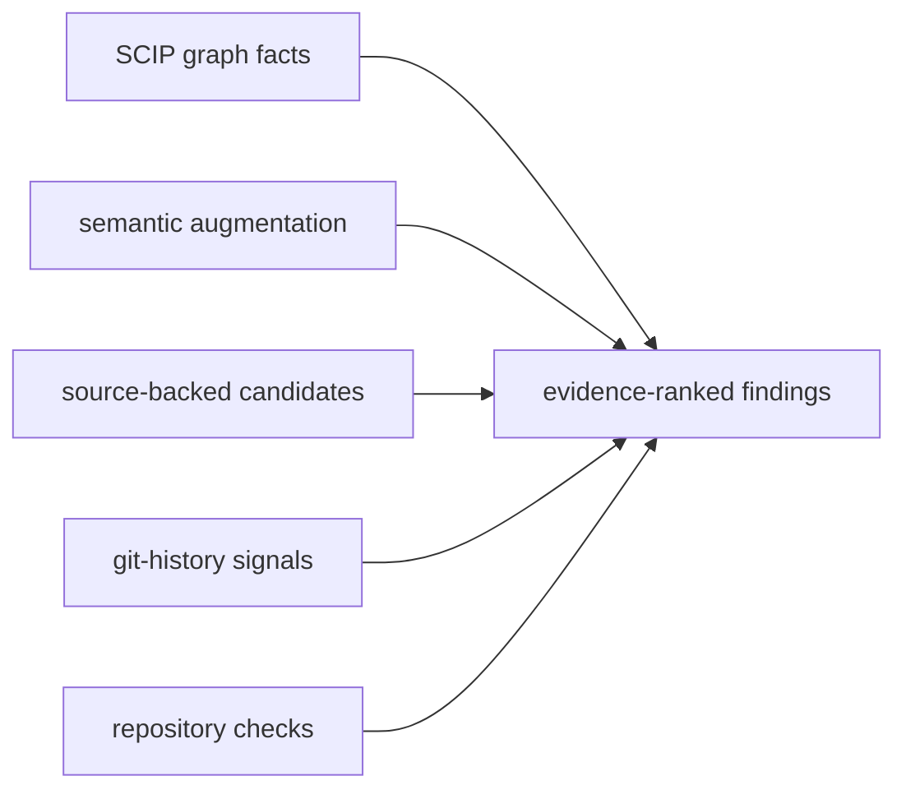

<h1 align="center">
  
</h1>

<p align="center">
  <strong>Evidence and verification for AI coding agents.</strong>
</p>

<p align="center">
  <em>Map the repo. Reuse what exists. Finish the refactor. Gate the diff.</em>
</p>

<p align="center">
  <a href="https://www.npmjs.com/package/scip-query"></a>
  <a href="https://www.npmjs.com/package/scip-query"></a>
  <a href="package.json"></a>
  <a href="https://www.apache.org/licenses/LICENSE-2.0"></a>
</p>

`scip-query` is a TypeScript CLI and npm package that turns SCIP indexes, git history, language-aware source analysis, and your repository's own checks into commands AI coding agents can use before, during, and after a change.

Agents are effective at editing the code in front of them. They are less reliable at preserving a whole-repository model across a long task: they miss existing helpers, plan from partial context, migrate only some call sites, overlook files coupled only by history, and declare a diff finished while it still adds duplication, dead code, or stale documentation.

`scip-query` gives them a repeatable operating loop: map the target and its blast radius, build a concrete plan from repository evidence, check for reuse before adding a concept, detect unfinished migrations and hidden coupling, and gate the final diff. It does not replace the compiler, tests, or review; it makes structural evidence and repository checks easy for agents to invoke and report.

## The Agent Loop

| Phase | What the agent needs to establish | Commands |
|---|---|---|
| Orient | What exists, where it is defined, and what depends on it | `system`, `trace`, `affected`, `plan-context` |
| Plan | Externally consumed surfaces, change scope, blast radius, and historical partners | `surface`, `change-surface`, `co-change` |
| Reuse | Whether the helper, component, hook, or composable already exists | `similar`, `recent-duplicates` |
| Finish | Whether an extraction or migration reached every relevant site | `incomplete-migration`, `unused-params` |
| Verify | What the diff affected and whether covered structural checks regressed | `diff-impact`, `doc-drift`, `diff-gate`, `health --baseline` |
| Clean up | Candidate removals and newly exposed dead-code cascades | `cleanup-plan --verify` |

React and Vue repositories get additional framework-aware checks for repeated component/template structure, hook/composable behavior, and large-component or large-view pressure. These extend the same reuse and completion workflow; the core graph, history, planning, cleanup, and diff-gate commands are not frontend-specific.

## Install

```bash
npm install -g scip-query@latest
scip-query check-deps
scip-query reindex
```

Or without a global install: `npx scip-query@latest reindex`.

## Start with One Change

```bash
# Before editing: establish structure, consumers, history, and blast radius
scip-query plan-context <symbol-or-file>

# Before creating a helper or abstraction: look for the existing concept
scip-query similar <closest-symbol>

# After an extraction or migration: find sites that still contain old logic
scip-query incomplete-migration

# Before declaring the work complete: refresh the index and gate the diff
scip-query reindex && scip-query diff-gate
```

For a repository-wide cleanup pass:

```bash
scip-query health
scip-query recent-duplicates
scip-query cleanup-plan --verify
scip-query health --write-baseline
```

## Evidence and Confidence

`scip-query` keeps the source and strength of each answer visible:



1. **SCIP graph facts** for definitions, references, imports, calls, and dependencies.
2. **Semantic augmentation** for TypeScript where the SCIP index needs more detail.
3. **Source-backed candidates** for similarity, maintainability, and cleanup checks.
4. **Git-history signals** for churn, co-change, recency, and documentation drift.
5. **Repository-toolchain verification** for supported cleanup plans.

Heuristic findings are candidates for inspection, not proof of equivalence or bad design. Run `scip-query capabilities` to see which evidence and verification layers are available for the current repository and language.

## Language and Framework Coverage

Graph navigation works through supported [SCIP](https://github.com/sourcegraph/scip) indexers. Higher-confidence augmentation and verification vary by language and project toolchain. TypeScript currently has the richest semantic augmentation. React and Vue add built-in framework-aware maintainability checks on top of the core workflow.

## Cleaning Up AI-Generated Code

These checks target specific ways AI-assisted development rots a codebase. The full catalog, with prevention wiring for each detector, is in [docs/AI_FAILURE_MODES.md](docs/AI_FAILURE_MODES.md):

**1. Find the echoes.** Agents re-implement helpers, hooks, composables, and frontend components they didn't know existed. `recent-duplicates` makes similarity *directional* using git file ages - which side is the established original, which is the recent echo:

```
91%  ECHO  react-component  src/components/ProjectCardVisual.tsx  ProjectCardVisual  (added 62 commits ago)
     duplicates established  src/pages/HomePage.tsx  RecentProjectRow()
     basis: jsx-structure
     shared: component:ProjectCard, prop:title, event:click
100% TWIN  src/workflows/a.ts ensureAccessible() / src/workflows/b.ts ensureAccessible()
     (both new - one agent session duplicated itself; consolidate before they diverge)
```

**2. Finish the half-done extraction.** Agents extract a helper, rewire one or two call sites, and abandon the rest — the extracted logic survives inline at every site they missed. `incomplete-migration` finds helpers that are new in the diff, confirms they were wired in somewhere, and lists the established sites that still contain the helper's logic but never call it (containment scoring, because a missed site holds the helper's logic *plus* its own):

```
src/utils/priceLabel.ts  priceLabel()
  wired into: src/cards/price-summary-a.ts
  un-migrated: 100%  buildReportB()  (src/cards/price-summary-b.ts)
  un-migrated: 100%  buildReportC()  (src/cards/price-summary-c.ts)
```

**3. Catch your standards docs lying.** If you keep in-repo standards for agents to read before implementing, a stale standard is worse than none. `doc-drift` reads every doc's file citations *and* its co-change history, then flags docs whose code moved on without them — including **broken references** to files that no longer exist:

```
staleness 94  product/domain-model.md
  BROKEN REFERENCE: cites src/api/servicePlans.ts — that file no longer exists
  22 change(s) since doc update  src/workflows/serviceTasks.ts  (referenced by doc)
```

**4. Delete with project checks.** `cleanup-plan` runs dead-code analysis to a *fixpoint* — deleting batch 0 makes batch 1 dead, and the plan shows the cascade. `--verify` applies each batch in a throwaway git worktree and runs the supported checker detected for your project (differentially, so pre-existing errors don't drown the signal):

```
── Batch 0: deletable now (graph-fact, 67 LOC) ──
── Batch 1: dead once batch 0 lands (cascade, 21 LOC) ──
Batch 0: COMPILER-VERIFIED
```

When verification *fails*, the errors name the exact references the static evidence missed — that failure has caught real detector mistakes and stopped build-breaking deletions.

**5. Trim speculative generality.** `unused-params` finds trailing parameters no body ever uses (the classic "options for later"), scoped to removals that are type-safe by construction.

**6. Keep frontend reuse honest.** React and Vue have dedicated frontend hygiene checks: component-duplicate commands compare JSX/template structure, hook/composable commands compare state/effect/request behavior, and large-component/view commands flag files that concentrate too many reasons to change. `health --full` includes these as hygiene pressure, while `incomplete-migration` remains the direct check for a hook/composable/helper extraction that was wired into some sites but not all of them.

**7. Surface hidden coupling.** `co-change` finds file pairs that repeatedly change in the same commits with *no* dependency edge — schema ↔ generated inventory ↔ doc triangles, backend schemas ↔ frontend stores, `.env.example` ↔ its parser. The reference graph cannot see these; the change graph can.

**8. Gate every diff.** `diff-gate` runs a defined set of checks scoped to what a change *introduces* — echoes of established code, incomplete migrations, missing co-change partners, docs that cite the changed files, fresh unused params, new dead symbols, baseline regressions — and exits nonzero with remediation text for each finding:

```
[co-change-partner] schema.prisma changed, but scripts/scope-inventory.mjs did not — they change together 12x (86% of the time)
  -> Update scripts/scope-inventory.mjs alongside this change, or confirm the coupling no longer holds.
```

**9. Ratchet it in CI.** `health --write-baseline` snapshots finding identities into a committable file; `health --baseline` exits 1 on any *new* finding. "Don't get worse" is an objective gate that no score arithmetic can game.

Accepted findings can be recorded without weakening the rest of the gate:

```bash
scip-query suppress SQABC123DEF456 --check echo --reason "intentional compatibility shim"
```

This appends a reasoned entry to `.scipquery.json`; `config-validate` rejects suppressions without an identity and reason, and `diff-gate --json` reports both active and suppressed findings.

Before any edit, `plan-context <target>` bundles the structural picture — definitions, references, call graph, blast radius — plus a HISTORY section: churn, fix-commit density, and the files that usually change together with the target ("editing this usually means editing these").

## A Health Score You Can Argue With

`scip-query health` refuses to be a vanity number:

```
Codebase Health Score: 95/100
  Risk:    95/100  (history-correlated signals: graph facts + change graph)
  Hygiene: 100/100 (tidiness candidates)

Score Breakdown (100 minus the following):
  - 5  hidden-coupling: 5 co-changing pair(s) without a dependency edge

Axes:
  Deletable:            1,027 LOC across 89 symbols
  Change amplification: 5 files/commit median, 23 p90
  Evidence quality:     5 graph-fact, 150 heuristic, 0 user-suppressed
  Validation:           flagged fix-density 0.12 vs baseline 0.20 (0.6x)
```

- **Risk vs. Hygiene** are separate claims: risk components are tied to graph facts and repository-history signals; hygiene components are tidiness. Blending them is how scores become meaningless.
- **Every deduction is itemized** — the scalar is auditable, not vibes.
- **The validation axis is a falsifiability loop**: it measures whether flagged files actually attract more fix commits than the rest *in your repo*, per detector. On some codebases a detector tracks repeated fixes; on others it is mostly noise — the tool reports which, instead of assuming.
- **Suppressions are data**: every `// scip-query: ignore-*` comment is a precision label, counted and reported.

## Accuracy Model

Evidence tiers are kept explicit, strongest first:

1. **Compiler-backed facts** from the SCIP database (`trace`, `refs`, `deps`, `outline`, ...).
2. **Semantic augmentation** via `ts-morph` for TypeScript — verified references, callers, callees when SCIP alone is incomplete.
3. **Source-backed heuristics** (AST/text) for cleanup signals. Always labeled: *"these are candidates, not exact compiler facts."*
4. **Compiler verification** for deletions — the only tier that earns the word "safe."

And because accuracy you don't measure is a feeling, `self-audit` samples symbols and scores the cheap paths against the TypeScript compiler:

```
references  precision 1.0  recall 0.9   (the cheap path doesn't fabricate; it occasionally misses)
```

Heuristic detectors carry guardrails learned from real codebases: published `package.json` surfaces are exempt from "unused" advice, `contracts/` and `types/` modules are exempt from "definer never uses it," test files and component-sibling files don't count as hidden coupling, and changelogs-by-policy aren't drift.

## Agent Skills

`scip-query install-skills` symlinks ready-made skills into Claude Code, Codex, and shared agent roots (`~/.agents/skills/`) — they update automatically with the package. The `scip-query` router skill triggers on any codebase work and dispatches to the right specialist: exploring (`scip-explore`), debloating (`scip-debloat`), maintainability review (`scip-maintainability`), React frontend maintainability review (`scip-react-maintainability`), Vue frontend maintainability review (`scip-vue-maintainability`), post-change verification (`scip-verify`), doc reconciliation (`scip-doc-reconcile`), AI-rot cleanup (`scip-ai-cleanup`), per-language guidance (`scip-language-playbook`), and grounded planning (`concrete-plan`).

Then, once per project, `scip-query setup-agent` seeds the `AGENTS.md` guidance block (plus a `CLAUDE.md` import shim, since Claude Code doesn't read AGENTS.md natively), and `--git-hook` adds a pre-commit diff gate that fires no matter which agent — or human — wrote the change.

## Quick Start

```bash
scip-query check-deps        # verify indexers are runnable
scip-query install-skills    # optional: agent skills
scip-query reindex

scip-query stats
scip-query system src/auth
scip-query plan-context login
scip-query health
scip-query cleanup-plan --verify
scip-query health --write-baseline   # start the ratchet
```

## Prerequisites

- Node.js >= 18
- `scip` CLI, from [Sourcegraph SCIP releases](https://github.com/sourcegraph/scip/releases)
- A language-specific SCIP indexer for your project

| Language | Indexer | Install |
|---|---|---|
| TypeScript / JavaScript / Vue | scip-typescript | `npm install -g @sourcegraph/scip-typescript` |
| Java / Scala / Kotlin | scip-java | [releases](https://github.com/sourcegraph/scip-java/releases) |
| Rust | rust-analyzer | Ships with rust-analyzer: `rust-analyzer scip` |
| Python | scip-python-plus | `npm install -g scip-python-plus` |
| Go | scip-go | `go install github.com/sourcegraph/scip-go@latest` |
| Ruby | scip-ruby | [releases](https://github.com/sourcegraph/scip-ruby/releases) |
| C / C++ | scip-clang | [releases](https://github.com/sourcegraph/scip-clang/releases) |
| C# / VB | scip-dotnet | [releases](https://github.com/sourcegraph/scip-dotnet/releases) |
| Dart | scip-dart | [releases](https://github.com/nicovince/scip-dart/releases) |
| PHP | scip-php | [releases](https://github.com/nicovince/scip-php/releases) |

For Python, the executable may be `scip-python`, `scip-python-plus`, or both. `scip-query` accepts either name.

Vue single-file components are handled through the JavaScript/TypeScript indexer. `scip-query` also extracts the `<script>` or `<script setup>` block so symbol, reference, and import queries cover Vue components alongside regular `.ts` and `.js` files.

`scip-query capabilities` prints project-level readiness plus a per-language matrix for SCIP indexing, source fallback evidence, semantic provider support, cleanup detector support, and cleanup verification coverage. Use it when you need to know whether a finding is graph-backed, semantic, heuristic, or compiler-verified for the language in front of you.

## How It Works

1. A SCIP indexer analyzes source code with the actual compiler, type checker, or language server and produces `index.scip`.
2. The `scip` CLI converts that protobuf file to a SQLite database: `index.db`.
3. `scip-query` runs SQL queries, language-aware source augmentation, and git-history analysis against it.

By default, indexes live in `~/.cache/scip-query/projects/<hash>/`, keeping project directories clean. Override paths with `.scipquery.json` or `SCIP_QUERY_*` environment variables. Reindexing writes per-language SCIP shards next to the SQLite index, so a mixed-language repo can reuse unchanged language outputs and rerun only the languages whose source/config inputs changed.

Most read-only commands accept `--json` and use the same envelope:

```json
{ "command": "fan-in", "args": ["login"], "options": { "json": true }, "result": [] }
```

## Configuration

Run this in a project root:

```bash
scip-query init
```

It creates `.scipquery.json`:

```json
{
  "languages": ["typescript"],
  "watch": {
    "enabled": false,
    "debounceMs": 30000,
    "cooldownMs": 60000
  },
  "indexer": {
    "typescript": {
      "pnpmWorkspaces": true
    }
  }
}
```

Use `declaredCouplings` for files that intentionally form one maintenance unit.
These pairs are treated as structurally linked by `co-change` and health, while
still appearing in file-specific exploration:

```json
{
  "declaredCouplings": [
    {
      "name": "cleanup detector family",
      "reason": "These detectors share candidate, evidence, and health policy changes.",
      "files": [
        "src/queries/dead.ts",
        "src/queries/isolated.ts",
        "src/queries/stale-abstractions.ts"
      ]
    }
  ]
}
```

Useful environment variables:

| Variable | Purpose |
|---|---|
| `SCIP_QUERY_PROJECT_ROOT` | Override the project root directory |
| `SCIP_QUERY_INDEX_DB` | Override the SQLite database path |
| `SCIP_QUERY_INDEX_SCIP` | Override the SCIP protobuf path |
| `SCIP_QUERY_CACHE_DIR` | Override the cache directory |

Query results are filtered through the project's `.gitignore`. If none exists, common generated directories such as `dist/`, `target/`, `node_modules/`, and `.venv/` are excluded by default.

## Documentation

- [AI Failure Modes](docs/AI_FAILURE_MODES.md): every specific way AI coding rots a codebase, the detector built for it, and how to wire prevention in.
- [Detector Guide](docs/DETECTOR_GUIDE.md): what each detector measures, the differences between the confusable ones, and which check to run after which kind of change.
- [Agent Guide](docs/AGENT_GUIDE.md): goal-oriented workflows for tracing, planning, cleanup, quality checks, and change verification.
- [Command Reference](docs/COMMAND_REFERENCE.md): generated command syntax, descriptions, and options.
- [Programmatic API](docs/API.md): using the query functions from TypeScript.
- [Historical plans](docs/plans/): implementation notes and completed cleanup plans.

## License

Apache-2.0
