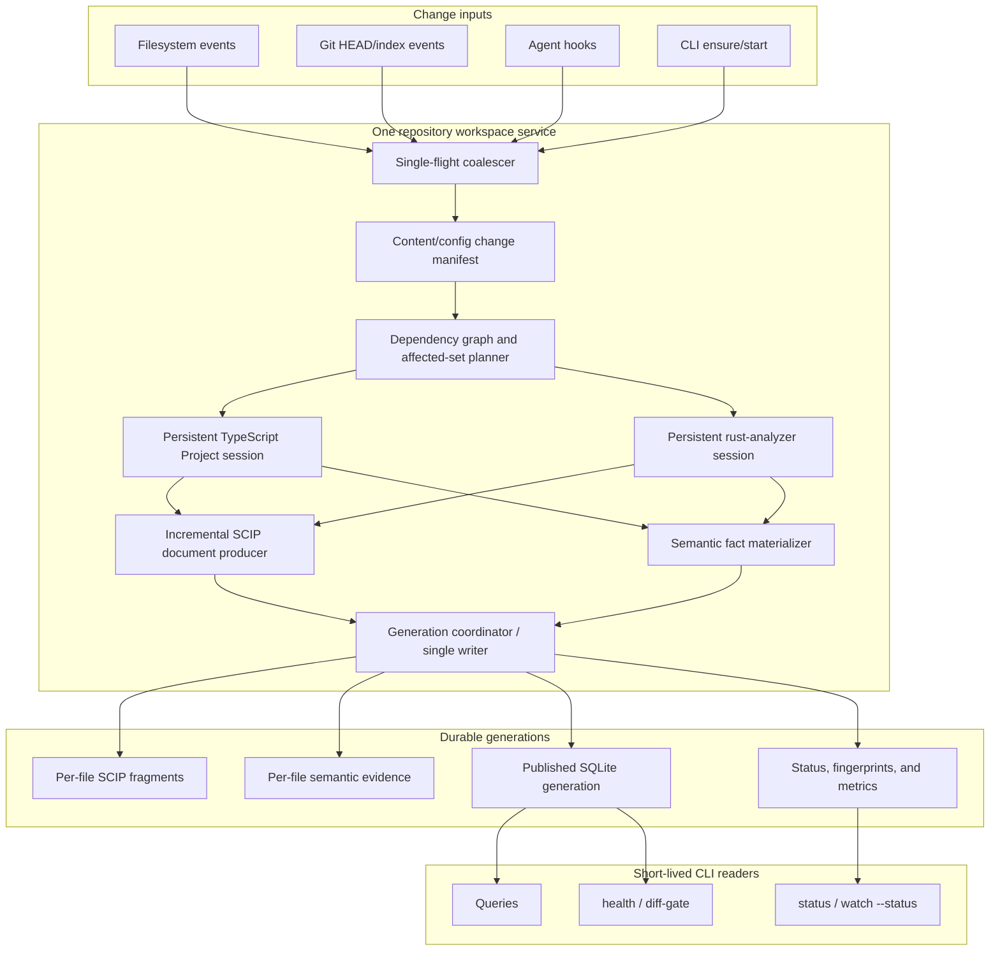

# Automatic Incremental Indexing Roadmap

Date: 2026-07-09
Status: Phases 1–3 complete; Phase 4A TypeScript feasibility proven and implementation in progress

## Goal

Make scip-query automatically maintain a compiler-correct, query-ready code
generation after edits while recomputing only the affected index documents and
semantic facts. Warm commands must reuse live TypeScript and Rust compiler
state across CLI processes, and every optimization must preserve the accepted
output and semantic-fact contracts.

The requested end state is not merely “run reindex in the background.” It is a
repository-scoped service that notices changed content, proves which files can
be affected, updates those files' compiler-backed graph and semantic data, and
atomically publishes one complete generation.

Read the verified starting point first:
[`2026-07-09-incremental-indexing-current-state.md`](./2026-07-09-incremental-indexing-current-state.md).
The recommended first implementation slice is
[`2026-07-09-automatic-freshness-service.md`](./2026-07-09-automatic-freshness-service.md).

## Definition of Done

The program is complete when all of these statements are true:

1. With `watch.enabled: true`, the repository service starts on demand without
   a user keeping `scip-query watch` open, reports its state, recovers from
   crashes, exits after a configurable clean idle period, and wakes on the next
   CLI or agent-session use.
2. A burst of edits produces one in-flight refresh and at most one coalesced
   follow-up. Readers continue to see the preceding complete generation until
   the next one is atomically published.
3. The service computes a conservative affected set from content, compiler
   configuration, and dependency changes. Uncertainty widens the set; it never
   silently narrows it.
4. TypeScript Project state and rust-analyzer state survive separate CLI
   commands. Fully warm commands do not reconstruct an unchanged TypeScript
   Project or restart a compatible Rust session.
5. TypeScript references, callees, signatures, and import usage have durable
   per-file or affected-set cache identities. Unaffected files retain at least
   a 95% semantic cache-hit rate in representative one-file edit trials.
6. TypeScript and Rust indexing can replace affected SCIP documents without
   rerunning a whole project indexer, or a measured feasibility decision proves
   that an upstream indexer boundary must change before this claim is shipped.
7. Every published generation matches a clean full rebuild on the graph and
   semantic facts in the output contract. No partial or failed generation is
   advertised as fresh.
8. A native Rust port is accepted only for an isolated CPU-bound span whose
   end-to-end command speed improves after process/serialization overhead. A
   whole-CLI rewrite is not required for completion.

## Current State

- Exact unchanged refresh is already fast: 323 ms on this repository in the
  current snapshot.
- Language shards and TypeScript project shards are durable. This repository's
  only TypeScript project shard is `.`, so one TypeScript edit still rebuilds
  the root project shard; the observed campaign refresh was about 4.7 seconds.
- `Watcher` provides calibrated 250ms debounce, single-flight execution, a
  dirty flag, zero default cooldown, Git polling, and atomic reindex
  child-process publication.
- One demand-started service per enabled project now owns the shared watcher
  lock, heartbeat/status protocol, automatic command/hook wake-up, stale
  startup refresh, crash replacement, and default 10-minute clean-idle exit.
  Foreground `scip-query watch` remains available under the same lock.
- Five real local leaf edits reached fresh in 4.543s median / 4.885s p95;
  five 20-write bursts reached fresh in 5.065s median / 5.229s p95 with one
  indexing transition and exact restored output in every run.
- TypeScript uses ts-morph, but `SemanticSessionManager` caches its provider
  only inside one `ScipDatabase` object/process.
- Semantic callees have file/dependency keys. TypeScript semantic references
  use the whole project fingerprint, while TypeScript signatures and import
  usage are not durably cached.
- The durable rust-analyzer session and exact response cache are implemented
  and benchmark-accepted as an opt-in. They are not yet the default product
  lifecycle.
- Fresh reindex atomically promotes a complete `.scip`, SQLite database, and
  metadata record. The SQLite database is reconstructed from the merged SCIP
  artifact rather than updated by changed documents.
- The installed `scip-typescript` CLI exposes no changed-file indexing mode.

Primary evidence:

```bash
scip-query plan-context src/runtime/watch.ts --json
scip-query plan-context src/reindex/index.ts --json
scip-query plan-context src/semantic/shared-primitives.ts --json
scip-query plan-context src/semantic/typescript/ts-morph-provider.ts --json
scip-query plan-context src/semantic/rust/durable-session.ts --json
scip-query refs Watcher --json
scip-query refs getIndexFreshness --json
scip-query refs createTsMorphProvider --json
scip-query refs createDurableRustAnalyzerSessionRequester --json
scip-typescript index --help
```

## Reuse Audit

- Reuse `Watcher` as the edit-coalescing state machine. It already has the
  correct single-flight and dirty-follow-up rules; process lifetime is the
  missing layer.
- Move the existing watch lock/state logic out of `command-handlers.ts` into a
  focused service boundary rather than create a second lock implementation.
- Reuse `getIndexFreshness()` for startup and recovery checks. Do not duplicate
  the current metadata/fingerprint comparison.
- Reuse the reindex worker and `publishFreshReindexArtifacts()` through Phase
  1. Automatic freshness can ship before index sub-shards exist.
- Reuse project-file fingerprints, TypeScript project discovery, and the
  existing file dependency graph as inputs to one affected-set engine. Do not
  invent a second path-normalization or content-hashing system.
- Reuse `SemanticProvider` as the query-facing contract. A persistent
  TypeScript session should change provider ownership and transport, not every
  semantic caller.
- Reuse the accepted durable Rust identity, host, crash recovery, and response
  cache. Its filesystem mailbox is synchronous and Rust-specific; copy neither
  its protocol nor its files blindly into the asynchronous watch service.
- Reuse the current evidence-cache transaction boundary and add versioned keys
  through dual-read/dual-write migrations. Do not drop old rows before parity
  and rollback gates pass.
- Preserve the current atomic publish guarantee. Incremental work changes what
  is computed, not the rule that readers see only complete generations.
- Do not assume a Rust rewrite is reuse. Existing native consumer experiments
  were neutral or slower after helper-process overhead; only profiled kernels
  qualify.

## Target Architecture



The service is the only writer. TypeScript and Rust compiler sessions may do
independent computation concurrently, but SQLite generation publication is
serialized. That rule prevents two processes from publishing incompatible
views of the same repository.

## Architecture Decisions

### AD-1: One demand-started owner for observation, compiler state, and publication

The background service owns watcher events and reusable compiler sessions.
Short-lived query commands remain simple SQLite readers. This avoids paying
compiler startup per command and gives invalidation one authoritative owner.
The owner is per project, not global: project fingerprints, locks, compiler
configuration, and memory are independent. It exits after a default 10-minute
clean idle period and is restarted by the next CLI/hook ensure operation;
durable indexes and semantic evidence remain on disk while it sleeps.

### AD-2: Content identity before event identity

Filesystem events are hints, not truth: they can duplicate, reorder, or omit
details. The service converts them into a canonical change manifest by hashing
current relevant files/configuration. The manifest, not the raw event count,
drives invalidation.

### AD-3: Conservative affected sets with project fallback

An affected-set planner may over-invalidate but must not under-invalidate. A
changed tsconfig, package manifest, compiler identity, generated-code boundary,
unresolved import, or unknown edge widens the update to the containing project
or full repository. Shadow comparison proves narrower rules before they write
production generations.

### AD-4: Persistent ts-morph first; tsserver only if measured

ts-morph already supplies accepted TypeScript semantics and wraps the
TypeScript compiler API. The first persistent TypeScript session keeps that
Project alive and updates source files. Replacing it with tsserver is a later
comparison only if the persistent ts-morph path cannot meet correctness or
latency gates.

### AD-5: A sub-shard is a compiler output boundary, not just a cache file

A finished whole-project SCIP file can be split into document files, but that
does not avoid whole-project compiler/indexer work. Phase 4 first proves an
incremental SCIP document producer. Acceptable routes are an upstream
scip-typescript incremental API, an embeddable document emitter, or a local
producer built on the persistent TypeScript compiler session. The route is not
chosen before the parity spike.

### AD-6: Atomic generations, not visible in-place mutation

Changed fragments and semantic rows are assembled under a new generation ID.
The current-generation pointer changes only after validation and transaction
commit. A crash leaves the prior generation readable and the incomplete one
collectable.

### AD-7: Rust only where the profile pays for the boundary

Native code is a delivery mechanism for CPU-bound work, not a performance
definition. A Rust slice must represent at least 10% of the measured command
wall time and must improve the end-to-end command by at least 5% or the target
span by at least 20%, with identical output, before acceptance.

## Testability Design

| Behavior                   | Pure core                                              | Injected boundary                              | Contract test                                                    |
| -------------------------- | ------------------------------------------------------ | ---------------------------------------------- | ---------------------------------------------------------------- |
| Service state and recovery | parse/classify state, choose start/stop/recover action | clock, PID liveness, spawn, signal, filesystem | dead/stale state is replaced; one live owner remains             |
| Edit coalescing            | watcher state transitions                              | timers, reindex runner                         | one in flight; edit burst yields at most one follow-up           |
| Change manifest            | compare canonical file/config identities               | file enumerator and hasher                     | add/modify/delete/config changes are deterministic               |
| Affected-set planning      | graph reachability and widening rules                  | dependency graph provider                      | no full-rebuild output change falls outside predicted set        |
| TS session reuse           | identity/transition decision                           | Project factory and source updater             | compatible edit reuses Project; incompatible config replaces it  |
| Semantic cache keys        | versioned key derivation                               | compiler identity and dependency digests       | unrelated edit preserves key; answer-affecting edit changes it   |
| Fragment publication       | generation plan and validation                         | SQLite transaction/filesystem                  | readers see old or new complete generation, never a mixture      |
| Incremental parity         | normalized graph/semantic diff                         | full and incremental producers                 | document/symbol/reference/semantic facts are identical           |
| Rust defaulting            | session selection and fallback                         | durable requester and worker fallback          | crash, timeout, version mismatch, uninstall, and opt-out recover |
| Native kernel              | input/output codec                                     | JS and Rust implementations                    | byte-equivalent results plus end-to-end benchmark threshold      |

Every side-effecting component needs a pure decision core and an injected shell.
Compiler integration tests use small real fixtures; large corpora are benchmark
and parity gates rather than unit tests.

## Pre-Registered Benchmark Contract

### Existing baselines

| Metric                                                  |                 Current observation |
| ------------------------------------------------------- | ----------------------------------: |
| Local exact unchanged reindex                           |          0.329s median / 0.348s p95 |
| Local TypeScript edit refresh, Rust reused              |          4.543s median / 4.885s p95 |
| Current configured quiet delay / cooldown               |                         250ms / 0ms |
| SynthRunnerRust historical cold reindex                 |                              31.0 s |
| SynthRunnerRust accepted durable-cache warm full health |                             2.699 s |
| Vega accepted durable-cache cold full health            |                           190.685 s |
| Vega accepted durable-cache warm full health            | 41.933 s forward / 46.310 s reverse |
| Vega warm candidate loading                             |      13.837 s of a 45.918 s command |

The Phase 1 harness reran the local no-op/edit/burst/service baselines as five
samples and recorded median, p95, output hash, fact counts, cache disposition,
and machine metadata. The broader Phase 0 semantic/corpus matrix remains
incomplete; Phase 2 step 2.6 closes the affected-set portion before any
prediction can become authoritative. Historical external values remain context
until their alternating-order reruns become the comparison baseline.

The **median** is the middle measured run after sorting; it represents the
typical result without letting one extreme dominate. The **p95** is the value
that 95% of measured runs finish at or below; it exposes slow-tail behavior.
**Parity** is equality between incremental and clean full results after
irrelevant ordering/encoding differences are normalized. **Recall** is the
fraction of files or facts that truly changed in a clean rebuild and were also
included by the predicted affected set; 100% recall means no required unit was
omitted.

### Acceptance thresholds

| Milestone                           | Hard gate                                                                                                                                                                                                                                                                         |
| ----------------------------------- | --------------------------------------------------------------------------------------------------------------------------------------------------------------------------------------------------------------------------------------------------------------------------------- |
| Phase 1 automatic service           | Event-to-refresh-scheduled p95 <= 1.5 s; local edit-to-fresh p95 <= 8 s with current project shard; unchanged refresh median <= 0.5 s and p95 <= 0.75 s; 20-write burst causes <= 2 refreshes and never concurrent reindex; foreground output hashes unchanged.                   |
| Phase 2 affected-set shadow         | 100% recall against documents/facts changed by clean full rebuilds on all fixtures and corpora; median leaf edit affects < 20% of project files on at least two representative TS projects; any uncertainty widens rather than misses.                                            |
| Phase 3 persistent TS semantics     | Fully warm command constructs zero new unchanged Projects; unaffected semantic cache-hit rate >= 95%; TS-heavy command median improves >= 20% or measured Project/semantic span improves >= 50%; exact output/fact parity.                                                        |
| Phase 4 incremental SCIP documents  | Leaf-edit edit-to-fresh p95 <= 2 s locally and <= 5 s on the selected large TS corpus; clean full-rebuild parity is exact; failure falls back to project rebuild; no-op regression <= 10%. These are north-star gates and may be revised only with a recorded feasibility result. |
| Phase 5 generation store            | Crash at every publication failpoint leaves the preceding generation readable; zero mixed-generation reads under concurrent query stress; incremental and full generations normalize identically.                                                                                 |
| Phase 6 Rust default/native kernels | Durable default has <= 5% cold/warm regression on any corpus and retains current accepted facts; native slices meet AD-7 threshold and exact parity.                                                                                                                              |

All timing gates use the same built artifacts, cache state, environment, corpus
commit, and alternating run order. A speedup is rejected if output hashes or
compiler-backed fact counts change unless an accuracy correction is declared
before measurement.

## Program Phases

### Phase 0 — Reproducible edit-to-fresh and semantic benchmarks

**Purpose:** turn the historical campaign into a repeatable system benchmark.

- Add a fixture harness that controls service state, file edits, cache layers,
  index generation, and restoration.
- Record no-op, one-leaf edit, one-export edit, config edit, burst edit,
  evidence-cold/session-cold, and evidence-cold/session-warm scenarios.
- Normalize and hash SCIP documents, SQLite graph facts, semantic references,
  callees, signatures, import usage, and command JSON.
- Run on scip-query, SynthRunnerRust, VegaAssistant, and one TypeScript-heavy
  multi-project corpus selected before implementation.

**Exit gate:** the harness detects a deliberately stale index and a deliberately
changed semantic fact, and repeated controls are stable enough to judge the
Phase 1 thresholds.

### Phase 1 — Automatic freshness service using current shards

**Purpose:** remove the manual foreground watcher and 30–60 second user delay
without waiting for a new index format.

- Add repository-scoped daemon start/status/stop/recovery around `Watcher`.
- Start it from enabled CLI/hook paths, refresh immediately if startup state is
  stale, and persist heartbeat plus watcher/generation status atomically.
- Treat CLI use and relevant file/Git events as activity; exit after a
  configurable 10-minute clean idle period, never while refresh work is
  pending, and let zero disable idle shutdown.
- Calibrate the debounce/cooldown defaults from 250/750/1500 ms and
  0/1000/5000 ms candidates; choose the lowest policy that passes the burst
  gate, then update this repository's explicit config.
- Preserve `scip-query watch` foreground behavior and current reindex atomicity.

**Dependency:** Phase 0 harness.

**Exit result:** correctness, edit-to-fresh, burst, cold-start, idle/wake,
crash-recovery, and built-package gates passed. The raw live-ensure command was
147ms p95 against the pre-registered 100ms process-wall target; its matched
daemon-specific overhead was <=9ms p95 because the stopped Node/CLI control was
151ms p95. The miss remains explicit in the Phase 1 plan and ledger.

### Phase 2 — Canonical change manifests and affected-set shadowing (complete)

**Purpose:** prove the invalidation boundary before using it to skip work.

- Create one versioned identity for source contents, compiler configuration,
  dependency manifests, compiler/indexer identity, and generated inputs.
- Produce add/modify/delete/config change manifests from consecutive service
  observations.
- Combine existing import/dependency evidence with TypeScript compiler edges
  and conservative widening rules.
- Run the predicted affected set in shadow mode while full project reindex and
  semantic computation remain authoritative.
- Persist prediction telemetry: predicted files, actually changed normalized
  documents/facts, misses, over-invalidation, fallback reason.

**Dependency:** Phase 1 service owns consecutive state.

**Executable plan:**
[`2026-07-09-affected-set-shadowing.md`](./2026-07-09-affected-set-shadowing.md).

**Progress:** Step 2.1 defines the canonical manifest and conservative fallback
contract with an observed red/green ambient-declaration safety probe. Step 2.2
now computes deterministic transitive consumer closure from the existing file
dependency product and widens every unavailable/uncertain boundary. Step 2.3
now compares normalized old/new document and graph-fact digests, with a proven
red under-prediction check. Step 2.4 connects these contracts at the atomic
publication seam and persists versioned latest/history telemetry only after a
successful full publication. A real zero-consumer TypeScript leaf edit recorded
100% recall at a 1/305-file prediction; an identical-input forced rebuild
recorded zero normalized fact changes. Oracle and telemetry failures remain
non-authoritative, and raw artifact bytes were proven unstable despite
normalized fact equality. Step 2.5 now exposes a validated
passing/failing/unavailable summary, exact telemetry paths, recall,
prediction/actual/miss sets, ratio, plan mode, and fallback reasons through
human and JSON status without adding a command option or touching ordinary
query envelopes. Step 2.6 then proved the contract with a discriminating
fixture matrix and five alternating leaf edits on each of two TypeScript
projects. scip-query predicted 1/305 documents (0.328%) with 100% recall;
OpenCode predicted 1/2,531 project inputs (0.0395%) with 100% recall. Shadow
overhead was 8.73% median / 9.10% p95 locally and 5.09% / 5.42% on OpenCode,
inside the pre-registered limits. The retained first OpenCode failure exposed
and corrected internal-directory-symlink fingerprinting. Add/delete/ambient/
config/malformed inputs still widen conservatively. Predictions remain
observational and are not used by runtime indexing.

**Exit result:** 100% recall with no misses on all accepted fixture and corpus
trials; both leaf ratios were below 1%; the deliberately under-predicted probe
failed as required. Machine evidence and the complete self-report live in the
Phase 2 plan and `docs/benchmarks/runs/2026-07-09-affected-set-shadow.jsonl`.

### Phase 3 — Persistent TypeScript session and durable semantic fragments

**Purpose:** stop rebuilding ts-morph Projects and stop invalidating unrelated
TypeScript semantic facts.

- Move TypeScript Project ownership behind the workspace service while keeping
  `SemanticProvider` as the caller contract and the in-process provider as
  fallback.
- Apply source additions, changes, and deletions to the persistent Project;
  replace it on tsconfig/compiler/package identity changes.
- Introduce versioned per-file semantic keys based on content, affected
  dependency/API digests, compiler identity, and fact-kind schema.
- Persist TypeScript references, callees, signatures, and import usage in
  batches under generation-aware keys.
- Dual-read old project-wide rows during rollout; compare old/new facts before
  deleting or ceasing writes to the old format.

**Dependency:** Phase 2 affected-set correctness.

**Executable plan:**
[`2026-07-09-persistent-typescript-semantics.md`](./2026-07-09-persistent-typescript-semantics.md).

**Planned boundary:** The existing demand-started watch service becomes the
single lazy owner of compatible ts-morph Projects. Synchronous CLI processes
use an atomic repository-local mailbox and fall back to the unchanged direct
provider on any service error. Reference facts are persisted as origin-file
fragments under conservative transitive semantic identities; legacy
definition-centric reads remain available during rollout. The recorded local
pre-change import-usage baseline is 927ms median / 1,307ms p95 with 212ms
median Project construction.

**Progress:** Step 3.1 now defines the conservative semantic identity. Ordinary
leaf contents affect only the leaf and transitive consumers' identities;
configuration, ambient declarations, membership, engine, and schema affect
every required identity. Missing graph evidence widens to a whole-project key,
while missing, duplicate, or unreadable required inputs disable reuse. An
export-dependency under-invalidation expectation was planted and observed red.
Step 3.2 now derives reference fragments owned by the file containing each
reference, reassembles them by stable SCIP target symbol, and dual-writes them
in one evidence-database transaction only after exact comparison with the
legacy definition-centric oracle. An omitted-origin probe reported the exact
missing facts. That shadow-only step left import, signature, callee, and
authoritative fragment routing to step 3.5.
Step 3.3 now owns compatible Project bundles in a lazy semantic host. Ordinary
source add/modify/delete refreshes those Projects and binds a new provider to
the next database generation without constructing replacement Projects.
Configuration, ambient, project-identity, and uncertain changes discard the
session and recreate it lazily. A real import change proved refresh visibility
with one Project factory call; a config change caused exactly one replacement.
Step 3.4 now routes synchronous TypeScript provider calls through an atomic
mailbox owned by the existing demand-started service. Requests bind to an exact
publication and fall back to the direct provider on every lifecycle/protocol
failure. Status exposes session counters. A built diagnostic reused one Project
across processes (180ms warm versus the 927ms baseline median) and across a real
leaf reindex (230ms, one refresh, zero replacements) with the exact output hash.
Step 3.5 now makes origin-file reference fragments authoritative for eligible
TypeScript batches while retaining the old definition rows/provider as the
rollback path. Partial hits compute and publish only missing origin files.
Import usage, file-owned signatures, and callees now share the conservative
transitive semantic identity. A fresh-process fixture reused every semantic row
without rewriting it; an ordinary leaf edit retained the unrelated fragment
and recomputed exactly the changed one. Step 3.6 then passed the corpus gates:
scip-query's warm import command is 237ms median / 250ms p95 versus 927ms /
1,307ms, while OpenCode is 307ms / 331ms versus direct controls at 7,910ms /
8,133ms. Leaf edits retained 310/311 local fragments and 2,529/2,530 OpenCode
fragments with exact output, one session refresh, zero replacements, and zero
new Projects. Prepared identity context reduced fully warm OpenCode reference
materialization from 9,506ms to 524ms. Concurrent, timeout/direct fallback,
idle/wake, crash recovery, config replacement, no-op, package-install, and full
verification gates passed. The 4GB OpenCode cold-reference OOM and subsequent
TypeScript declaration-file failure are retained; an 8GB bounded retry plus
compiler-symbol fallback published all 2,530 exact fragments.

**Exit result:** Phase 3 performance, hit-rate, parity, lifecycle, fallback,
no-op, and packaging thresholds passed on both accepted corpora. The direct
provider and legacy definition rows remain rollback paths.

### Phase 4 — Incremental SCIP document producer and sub-shards

**Purpose:** avoid whole-project TypeScript/Rust indexing for ordinary edits.

Execution plan and feasibility evidence:
[`2026-07-09-incremental-scip-documents.md`](./2026-07-09-incremental-scip-documents.md).

#### 4A. Feasibility spike

- Inspect scip-typescript's library boundary and upstream roadmap for a
  document-level incremental emitter; the installed CLI has no such option.
- Prototype one leaf-edit document update through: (a) upstream/embedded
  emitter, then (b) the persistent compiler API only if (a) is unavailable.
- Normalize the prototype document against clean scip-typescript output,
  including symbols, occurrences, relationships, documentation, and external
  symbols.
- Repeat the feasibility analysis for rust-analyzer SCIP output. Do not infer
  that semantic LSP reuse can emit complete SCIP documents.

**Result:** TypeScript is feasible through the shipped scip-typescript 0.4.0
`FileIndexer` only when the compiler program and project-wide symbol tables are
retained. The accepted probe matched all 311 base documents and a true edited
document byte-for-byte; its warm update plus emission took 3.277ms. The
stateless design matched only 251/311 and is rejected. Rust remains an upstream
boundary: rust-analyzer computes one project-wide `StaticIndex` before document
emission and exposes no SCIP-document LSP request.

#### 4B. Fragment store

- Store one canonical fragment per SCIP document plus producer/config identity.
- Recompute changed documents and the Phase 2 affected set; reuse all other
  fragments.
- Merge external-symbol metadata deterministically and garbage-collect deleted
  documents/symbols only after a complete generation validates.
- Keep the whole-project indexer as fallback and periodic parity oracle.

**Dependency:** Phase 3 persistent compiler state and Phase 2 affected sets.

**Exit gate:** Phase 4 thresholds pass. If no correct incremental producer is
feasible, publish the spike result and stop at fast persistent semantics plus
project-shard indexing rather than claiming file-level indexing.

### Phase 5 — Generation-aware incremental SQLite publication

**Purpose:** publish changed graph and semantic fragments without rebuilding
the entire database or exposing partial state.

- Add a versioned generation schema or generation-scoped replacement tables.
- Apply affected document/symbol/chunk/relationship/evidence changes in one
  writer transaction, validate counts/referential integrity, then flip the
  current-generation pointer.
- Keep the previous generation until readers drain or a bounded retention rule
  expires.
- Crash-test every transition and make full rebuild an online repair path.

**Dependency:** Phase 4 canonical fragments. This is intentionally after
fragment parity; an on-disk schema is a harder rollback than a shadow cache.

**Exit gate:** Phase 5 crash/concurrency/parity thresholds pass, including
package upgrade and downgrade fixtures.

### Phase 6 — Rust defaulting, selective native kernels, and rollout

**Purpose:** consolidate accepted warm-state work and use Rust only where it
changes end-to-end latency.

- Exercise the durable Rust session/response cache across install paths,
  upgrades, crashes, concurrent commands, service restarts, and opt-out.
- Move it behind the workspace service or default its existing helper only
  after lifecycle parity; preserve the per-command requester fallback.
- Migrate Rust semantic reference keys from project-wide identity to the Phase
  2 affected dependency identity where facts prove it safe.
- Profile remaining cold/full paths. Port only AD-7-qualified CPU kernels,
  preferring in-process native bindings over a helper process when safe.
- Roll out automatic service and incremental generations opt-in -> canary ->
  default, with status diagnostics, repair command, metrics, and documented
  rollback.

**Dependency:** earlier contracts and generation model.

**Exit gate:** no corpus regresses beyond the hard gate; default behavior is
self-healing and the old full rebuild remains a supported repair oracle.

## Stress-Test Findings and Required Responses

- **Missed or duplicated file events:** rescan content identities; events only
  schedule work.
- **Edit during refresh:** mark dirty and run one follow-up from the newest
  manifest; never queue unbounded refreshes.
- **Daemon crash or stale PID:** classify liveness plus heartbeat, clean stale
  state, and start one replacement under an exclusive lock.
- **CLI/service version mismatch:** reject reuse, let the old service exit, and
  start the installed version. State and protocol identities are versioned.
- **Compiler/config identity change:** replace the relevant session and widen
  to project/full rebuild.
- **Unresolved or dynamic dependency:** widen to the project; correctness beats
  a narrow affected set.
- **Generated files or build outputs:** hash declared source inputs and either
  model the generator edge or widen. Never trust modification time alone.
- **Concurrent query during publication:** read the preceding generation until
  the new transaction/pointer commits.
- **Disk full or write failure:** leave the preceding generation current and
  report the failed attempt; do not update freshness metadata.
- **Deleted/renamed file:** model delete plus add, remove old fragment only in
  the committed generation, and update reverse dependencies.
- **Long-running or hung compiler request:** bound it, mark the generation
  failed, and fall back to the full project path or prior generation.
- **Service unavailable:** short-lived commands retain current direct providers
  and full reindex repair; degraded status is explicit.

## One-Way Doors and Rollback Points

| Decision                                       | Why it is hard to reverse                                     | Required gate before crossing                         | Rollback                                                         |
| ---------------------------------------------- | ------------------------------------------------------------- | ----------------------------------------------------- | ---------------------------------------------------------------- |
| Change `watch.enabled` to auto-start semantics | Existing users may expect permission-only foreground behavior | CLI/docs/config tests and opt-out                     | `SCIP_QUERY_SKIP_WATCH_SERVICE`, config disable, foreground path |
| New semantic cache key/schema                  | Old installs may not read new rows                            | dual-read/write parity and upgrade/downgrade fixtures | continue old rows and old key reads                              |
| New incremental SCIP producer                  | It can subtly change compiler graph meaning                   | normalized full-rebuild parity on all corpora         | whole-project indexer remains authoritative fallback             |
| Generation-aware SQLite schema                 | Published storage affects every query                         | crash/concurrency/migration suite                     | preserve old DB and rebuild from full SCIP                       |
| Durable Rust default                           | Process lifetime and packaging vary by host                   | lifecycle matrix and <=5% regression gate             | env/config opt-out and worker requester fallback                 |
| Native Rust kernel                             | ABI/build/distribution cost becomes product surface           | AD-7 performance and package matrix                   | retain JS implementation until two releases stable               |

## Explicit Deferrals

- **DEFER:** Replacing ts-morph with tsserver. Persistent ts-morph is the
  smallest parity-preserving step; compare later only with evidence.
- **DEFER:** Rewriting the CLI or detector suite in Rust. Compiler startup and
  invalidation dominate the desired workflow; port isolated measured kernels.
- **DEFER:** Concurrent SQLite writers. Compiler work may be parallel, but one
  generation coordinator publishes.
- **DEFER:** File-level index writes before affected-set shadow recall is 100%.
- **DEFER:** Dropping old evidence rows during the first cache-key migration.
- **DEFER:** Defaulting durable Rust reuse before crash, package, version, and
  concurrent-command matrices pass.
- **DEFER:** Claiming incremental Rust SCIP output merely because the LSP
  semantic session is durable. The outputs are different products.
- **DEFER:** Optimizing Vega candidate loading again without a new profile;
  the last bulk experiment was slower and was reverted.

## Working Agreement for Execution

- Work directly on `main` as required by this repository.
- Execute one numbered checklist item per commit. A commit must pass its focused
  tests and leave the repository buildable; do not hide multiple failed
  experiments in one accepted commit.
- Before each implementation phase, refresh its concrete plan with
  `scip-query plan-context <target>` and source every code step.
- Record every benchmark trial, including rejected and reverted experiments,
  in the campaign JSONL/ledger with cache state and output hashes.
- If implementation deviates from an architecture decision, add a dated
  deviation entry before merging the change.
- After helpers, params, wrappers, schemas, or deletions, run the corresponding
  repository postcheck. Before every phase close, run `scip-query reindex &&
scip-query diff-gate --json`.

## Program Self-Report Template

Complete this at every phase close:

- **Delivered commits:** one line per checklist item.
- **Baseline and result:** median/p95, run count/order, cache/session state,
  corpus commit, output hashes, and semantic fact counts.
- **Parity:** normalized SCIP/SQLite/semantic differences; expected accuracy
  corrections must have been declared before the run.
- **Deviations:** architecture or execution changes, reason, approver, and new
  rollback point.
- **Deferrals:** each unfinished item with a concrete trigger for resuming it.
- **Rejected experiments:** code/commit, measurement, and whether fully
  reverted.
- **Operational findings:** crashes, stale states, packaging failures, and
  recovery evidence.
- **Next phase readiness:** dependencies satisfied, open blockers, and the
  exact first command to run.

## Execution and Ship Order

1. Phase 0 reproducible benchmark/parity harness.
2. Phase 1 automatic service with existing whole/project shards.
3. Phase 2 affected-set shadow mode.
4. Phase 3 persistent TypeScript semantics and per-file semantic keys.
5. Phase 4 incremental SCIP producer feasibility, then fragments if proven.
6. Phase 5 atomic incremental generation storage.
7. Phase 6 durable Rust defaulting, selective native kernels, and rollout.

The immediate action is Phase 4.1's supported emitter adapter. Phases 2–3 prove
which inputs are affected and reuse live compiler state plus unrelated
semantic fragments; Phase 4A has now proven the exact producer state that must
survive. Implement the adapter before the durable fragment store:

```sh
SCIP_QUERY_SKIP_WATCH_SERVICE=1 node dist/cli.js plan-context src/reindex/typescript-document-emitter.ts --json
```
