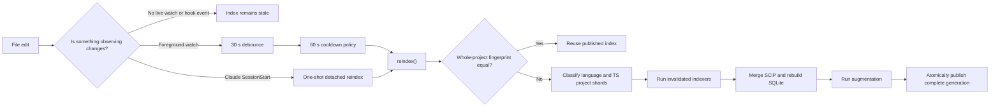

# Incremental Indexing and Semantic Analysis: Current State

Date: 2026-07-09

This document is the verified starting point for the automatic incremental
indexing roadmap. It explains what the repository does now, which parts are
already cached, and why a small edit can still trigger project-wide work.

The executable roadmap is
[`2026-07-09-automatic-incremental-indexing-roadmap.md`](./2026-07-09-automatic-incremental-indexing-roadmap.md).
The first implementation slice is
[`2026-07-09-automatic-freshness-service.md`](./2026-07-09-automatic-freshness-service.md).

## Essential Concepts

A **SCIP index** is a compiler-produced code graph whose defining trait is that
symbols, definitions, references, and source locations are recorded with the
compiler's name resolution rather than inferred only from text. The real
artifacts here are `index.scip` and the queryable `index.db` made from it.

A **shard** is an independently fingerprinted partition of that index whose
defining trait is that it can be reused or rebuilt without rerunning unrelated
language or project indexers. The current real shards are language shards such
as TypeScript and Rust, plus TypeScript project shards such as a workspace
package or `tsconfig.json` root.

A **fingerprint** is a content-derived identity record whose defining trait is
that equality means the inputs relevant to a cached result are unchanged. A
fingerprint is not a timestamp: it records paths, contents, configuration, and
other answer-affecting inputs.

A **sub-shard** is a smaller independently replaceable index partition whose
defining trait is that one changed file or affected group can be published
without rebuilding its entire project shard. scip-query does not have index
sub-shards today.

A **semantic fact** is compiler-resolved information computed for a question
after indexing, such as a symbol's references, callers, callees, signature, or
import usage. It is wider than an index row because some facts come directly
from the SCIP graph while others require ts-morph or rust-analyzer.

An **affected set** is the group of files whose answers may change after an
edit; its defining trait is causal reachability through imports, exports,
configuration, generated-code boundaries, or compiler dependencies. It
contains the edited file and the dependency closure that can observe its
changed meaning.

A **dependency closure** is a reachability set in a dependency graph whose
defining trait is that it includes every transitive consumer that can be
reached from the changed input. A dependency graph is a directed map from a
file or project to the inputs it depends on.

A **generation** is one internally consistent published snapshot whose
defining trait is that index rows, semantic facts, fingerprints, and status all
refer to the same source state. Atomic publication makes one complete
generation visible at a time, so readers never see a half-written index.

A **workspace service** is a repository-scoped background process whose
defining trait is that it owns change observation and reusable compiler state
across separate CLI commands. The current foreground watcher is not yet such a
service because the user must start it manually and keep its terminal alive.

A **daemon** is a background operating-system process whose defining trait is
that it continues after the command that launched it exits. In this roadmap the
daemon is the process that hosts the workspace service.

A **debounce** is a quiet-period scheduling rule whose defining trait is that
each new edit postpones one pending refresh, allowing a burst of saves to become
one operation. A **cooldown** is a minimum-spacing rule whose defining trait is
that a completed refresh delays the next refresh so repeated edits cannot
create an unbounded loop.

A **cache hit** is a reuse decision whose defining trait is that the requested
fact's complete answer-affecting identity matches a stored result. A cache miss
means that identity is absent or different and the fact must be recomputed.

The **Language Server Protocol (LSP)** is a request/response convention between
development tools and language servers whose defining trait is that semantic
questions can reuse one compiler-backed server. rust-analyzer speaks LSP.
**ts-morph** is a TypeScript compiler wrapper whose defining trait is that it
exposes Projects, source syntax trees, and type-checker answers as a convenient
programmatic API.

## Verified Snapshot

At the time of this review:

- `status --capabilities --json` reports a fresh TypeScript/Rust index with 300
  files, 19,581 symbols, and a 13.5 MiB SQLite database.
- An exact unchanged `reindex --json` reused both language shards and completed
  in 323 ms; both shard indexer durations were 0 ms.
- The TypeScript workspace has one project shard named `.`. Therefore any
  answer-affecting TypeScript edit invalidates the whole root project shard,
  even though the Rust language shard can still be reused.
- A TypeScript source edit during the current campaign refreshed in about 4.7
  seconds with the Rust shard reused. That is project-shard reuse, not
  file-level incremental indexing.
- `.scipquery.json` enables watching and auto-refresh but explicitly configures
  a 30,000 ms debounce and 60,000 ms cooldown.
- No watcher process or `watch.lock` is currently live. `scip-query watch`
  runs only in the foreground.
- Shared Claude hooks call `scip-query hook-context`; SessionStart can spawn a
  detached one-shot reindex when stale, while UserPromptSubmit only warns. The
  repository's Codex hook file is currently empty. Neither path provides an
  always-on workspace service.
- TypeScript semantics are available through ts-morph. Rust's durable
  rust-analyzer session and exact response cache exist behind an opt-in, so the
  default capability report still describes Rust queries as graph/source
  backed.

Reproduction commands:

```bash
scip-query status --capabilities --json
/usr/bin/time -p scip-query reindex --json
scip-query plan-context src/reindex/index.ts --json
scip-query code planTypeScriptProjectShardReuse
scip-query code createTsMorphProvider
scip-query code createDurableRustAnalyzerSessionRequester
```

## What Happens After an Edit Today



`reindex()` first computes the whole-project fingerprint under a process lock.
An exact match takes the fast path and reuses the existing artifacts. A
mismatch enters fresh reindexing, where language and TypeScript project
fingerprints can still preserve unaffected shards. The resulting SCIP files
are merged, converted to a temporary SQLite database, augmented, and renamed
into place.

The atomic publish path is a strength worth preserving. The expensive part is
the size of the invalidation unit: this repository's only TypeScript project
shard contains the whole root project, and the publish path still rebuilds the
combined SQLite artifact after a changed shard is indexed.

Source anchors:

```bash
scip-query code reindex
scip-query code reuseExistingIndexIfPossible
scip-query code runLanguageIndexersForFreshReindex
scip-query code planTypeScriptProjectShardReuse
scip-query code classifyTypeScriptProjectShardReuse
scip-query code publishFreshReindexArtifacts
scip-query code promoteReindexArtifacts
```

## What Is Cached Today

| Layer                                  | Durable across CLI processes? | Invalidation unit                                                         | Current consequence                                                                   |
| -------------------------------------- | ----------------------------- | ------------------------------------------------------------------------- | ------------------------------------------------------------------------------------- |
| Whole published index                  | Yes                           | Whole-project fingerprint                                                 | Exact no-op refresh is about 0.3 s locally.                                           |
| Language SCIP shard                    | Yes                           | All relevant files/config for one language                                | A TS edit can reuse Rust and vice versa.                                              |
| TypeScript project SCIP shard          | Yes                           | One discovered TS project plus dependencies/shared inputs                 | Useful in multi-project workspaces; this repo has only the root `.` shard.            |
| Health report                          | Yes                           | Project fingerprint, CLI version, scope, timeout, Git HEAD                | An exact repeated full report can return without recomputing its phases.              |
| Semantic references                    | Yes                           | TypeScript: whole project fingerprint; Rust: project plus engine identity | Any TypeScript project change invalidates every reference row in that project.        |
| Semantic callees                       | Yes                           | File content hash plus direct-dependency content digest                   | Unrelated files can remain warm; direct dependency changes invalidate the file.       |
| TypeScript import usage                | No                            | In-memory provider maps                                                   | Recomputed after a new CLI process constructs a provider.                             |
| TypeScript signatures                  | No                            | In-memory provider maps                                                   | Recomputed across CLI processes.                                                      |
| ts-morph Projects and source-file maps | No                            | One `ScipDatabase` object/process                                         | Every independent CLI process can pay project construction and source indexing again. |
| Rust live compiler session             | Opt-in                        | Project/compiler/worker/environment identity                              | Accepted warm speedups exist, but the durable path is not yet the product default.    |
| Rust response payloads                 | Opt-in                        | Exact session identity plus stable request                                | Accepted on the measured full-health workload.                                        |

The TypeScript provider creates one `ts-morph.Project` per configured tsconfig
with dependency resolution deferred. `SemanticSessionManager` stores providers
in a `WeakMap` keyed by a `ScipDatabase`, which saves repeated work only inside
one process. The process exit discards the Project and all provider maps.

Semantic references are read and written in file batches, but TypeScript rows
are keyed by the whole project fingerprint. Semantic callees use the narrower
file-content and dependency-digest key. TypeScript signatures and import usage
have no durable cache slot; the shared project-evidence slots currently accept
only Rust.

Source anchors:

```bash
scip-query code SemanticSessionManager
scip-query code createTsMorphProvider
scip-query code createTsMorphProjectBundles
scip-query code materializeSemanticReferenceBatch
scip-query code semanticReferenceCacheFingerprint
scip-query code cachedSemanticCalleeMap
scip-query code semanticCalleeDepsDigest
scip-query code semanticProjectSlotCacheFingerprint
scip-query code createDurableRustSessionIdentity
scip-query code durableSemanticResponseCacheKey
```

## Measured Performance Checkpoints

These are campaign observations, not promises for every machine. Exact paired
methodology and output hashes live in
[`docs/benchmarks/2026-07-09-ts-rust-indexing-analysis-ledger.md`](../benchmarks/2026-07-09-ts-rust-indexing-analysis-ledger.md).

| Workload                                                         |                       Observed time | Interpretation                                                          |
| ---------------------------------------------------------------- | ----------------------------------: | ----------------------------------------------------------------------- |
| Local unchanged reindex, 2026-07-09                              |                             0.323 s | Full fingerprint check plus exact artifact reuse.                       |
| Local TypeScript edit refresh                                    |                         about 4.7 s | Root TS project shard rebuilt; Rust shard reused.                       |
| SynthRunnerRust initial Rust-only reindex                        |                              31.0 s | Historical cold corpus baseline.                                        |
| SynthRunnerRust accepted durable response-cache warm full health |                             2.699 s | Reused Rust session and exact semantic response.                        |
| VegaAssistant accepted response-cache cold full health           |                           190.685 s | Compiler/session and semantic evidence cold.                            |
| VegaAssistant accepted response-cache warm full health           | 41.933 s forward / 46.310 s reverse | Live Rust state and exact response reused.                              |
| VegaAssistant pre-change warm full health                        |                            45.918 s | Candidate loading was 13.837 s and outer semantic prewarm was 26.055 s. |

The accepted durable Rust response cache roughly halved Vega's prior
80.97–83.86 second warm path, but it did not make the whole command cheap.
The rejected bulk candidate-loading experiment changed the 13.837 second
candidate stage to 14.050 seconds and the full command to 49.074 seconds, so it
was reverted. This is why the roadmap requires measured gates rather than
assuming that bulk loading or Rust code is automatically faster.

## The Five Remaining Structural Gaps

1. **Automatic ownership is missing.** The watcher has a sound single-flight
   state machine, but a terminal must own it. Configuration enables permission
   to start it; configuration does not currently keep it alive.
2. **The TypeScript index invalidation unit is too large.** Project-shard reuse
   is real, but the root project is the only shard here. A one-file edit still
   invokes the project indexer.
3. **TypeScript compiler state is process-local.** ts-morph Projects and their
   maps disappear after each command, so a warm SQLite cache does not imply a
   warm TypeScript compiler.
4. **TypeScript semantic reference keys are too broad.** The whole-project
   fingerprint makes unrelated reference rows cold after any project edit.
5. **Publication is whole-database.** Atomic replacement protects readers, but
   changed SCIP documents cannot yet be applied as one new generation without
   reconstructing the combined artifacts.

The shipped `scip-typescript index --help` exposes project selection and output
options but no changed-file or incremental output option. Splitting a finished
whole-project `.scip` file after the fact would reduce storage work, not the
compiler/indexer work. A genuinely fast sub-shard therefore requires an
incremental SCIP document producer, either embedded/upstreamed from
scip-typescript or implemented against the persistent TypeScript compiler
state. The roadmap treats that as a gated architecture decision.

## What “Radically Faster” Means Here

Moving arbitrary CLI code to Rust will not remove TypeScript compiler startup,
rust-analyzer readiness, a project-wide SCIP index, or incorrect cache
invalidation. Rust is valuable for a measured CPU-bound loop after process
boundary and serialization costs are included. The larger opportunity is to
stop repeating correct work:

- keep compiler processes and TypeScript Projects alive;
- compute one affected set from changed content and dependencies;
- preserve semantic facts for files outside that set;
- produce and publish only changed index documents;
- let every CLI process read the latest complete generation;
- fall back to a full rebuild whenever the affected set is uncertain.

That is the system described in the roadmap.
