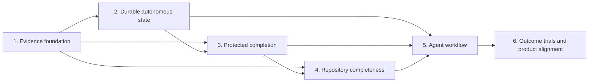

# Autonomous completion execution plan

Date: 2026-07-30
Status: implementation complete; protected program exit not met
Mission record: [Autonomous repository completion program](./2026-07-30-autonomous-completion-program.md)
Design record: [Epistemic clarification notes](../reviews/2026-07-30-epistemic-clarification-notes.md)
Canonical goal: `SQG-4061E7D5D360464ED8E8B05D53BBF49D`
Canonical intended change: `SQC-DED67E74D3898BDCA85766BE8D3C93AF`

## What this plan controls

This is the executable bridge between the settled product design and the
codebase. It covers the evidence contract, durable work state, completion
controller, repository-completeness policy, agent integration, and outcome
trials required for an autonomous coding agent to carry a supported change
from an authorized goal to independently verified completion.

An authorized goal is a concise, versioned description of the repository
condition a principal delegated the agent to establish. Its real-world
referents are the requested behavior, the conditions that must remain true,
and the externally observable examples that distinguish success from failure.
It is wider than a task list: tasks name actions, while a goal names the end
that makes those actions relevant.

Completion is a goal-relative repository judgment: the current repository
embodies the authorized end, every consequence discovered under the declared
coverage policy is reconciled, and no surviving artifact falsely presents an
obsolete alternative as current. This is wider than passing tests. Its
distinguishing cause is reconciliation of the whole affected repository
surface, which is what prevents locally correct work from leaving residue that
misdirects later agents.

The program is done only when the six phase exit contracts below pass together.
Writing all planned code is not completion if a protected scenario, performance
threshold, compatibility check, or mission trial fails.

## Governing constraints

1. No routine human approval occurs inside an authorized execution. A human
   may author or authorize the goal, repository policy, and transition rules
   before execution; the agent handles ordinary observations, decisions,
   retries, suppressions, and verification itself.
2. No ceremony is accepted merely because it makes a workflow look controlled.
   A mandatory action must change the repository, supply decision-relevant
   evidence, preserve otherwise-lost work state, verify an effect, or retain a
   live obligation.
3. The working agent cannot make completion easier solely by editing the goal,
   evaluator, policy, test, baseline, suppression, or configuration that judges
   the same attempt.
4. Evidence producers state checkable facts. Product policy derives evidence
   authority. Repository policy decides permitted action. These three
   responsibilities do not collapse into one flag.
5. Shared records that must merge with code live in `.scipquery/` and are
   committed with the change that produced them. Workspace caches and
   process-local restoration records remain outside Git.
6. Every serialized shape evolves additively or through an explicit
   expand/migrate/contract sequence. Old records remain readable as
   lower-authority history.
7. Every slice uses compiler-resolved planning evidence before editing and the
   relevant focused tests, typecheck, build, public API check when applicable,
   and `scip-query diff-gate` after editing.

## Pre-registered program baselines

These measurements were captured before the first automatic-evidence slice:

- `stats --json --compact`: 244.0 ms median across five warm runs.
- First-slice result: 243.3 ms median across nine warm runs.
- First-slice focused tests: 39 of 39 passed.
- Full-suite reference: 2,188 of 2,193 passed. The five failures reproduce in
  the unchanged shared-worktree integration test because its temporary
  repositories cannot resolve the relative indexer binaries.
- Diff gate: zero findings after the first slice.
- Health baseline: 96 older repository-wide deltas; it is not used as a clean
  pre-change baseline for this program.

The per-slice local guard is no more than a 20% median regression on the nearest
comparable automatic path unless the slice pre-registers a different threshold
and explains why. The final mission trial uses end-to-end elapsed time, model
tokens, tool calls, failed attempts, and rework rather than microbenchmarks
alone.

## Dependency graph



The order follows proof dependencies. A controller cannot judge completion
until evidence identifies what operation occurred and what state it observed.
It cannot survive long work until goal and attempt state is durable. Repository
obligations are then admitted into that controller, the agent workflow consumes
the integrated protocol, and only the resulting complete system is eligible
for mission claims.

## Phase contracts

### Phase 1 — Evidence foundation

Plan: [Phase 1: evidence foundation](./2026-07-30-autonomous-completion-phase-1-evidence.md)

Exit condition: every public machine-readable operation names its actual role;
repository assertions carry a version-2 receipt and independent claim
qualifications; legacy results decode without gaining authority they did not
establish.

### Phase 2 — Durable autonomous state

Plan: [Phase 2: durable autonomous state](./2026-07-30-autonomous-completion-phase-2-state.md)

Exit condition: a goal, intended change, attempts, decisions, and live
obligations survive process death, compaction, branch movement, and cooperating
writers without silent loss or duplicated effects.

### Phase 3 — Protected completion

Plan: [Phase 3: protected completion](./2026-07-30-autonomous-completion-phase-3-controller.md)

Exit condition: completion is a typed, goal-relative state transition based on
a fixed evaluation context; self-modified judgment artifacts cannot certify
themselves, and pre-authorized successor rules permit autonomous evolution.

### Phase 4 — Repository completeness

Plan: [Phase 4: repository completeness](./2026-07-30-autonomous-completion-phase-4-completeness.md)

Exit condition: enforceable architecture rules and qualified residue findings
become durable completion obligations; each obligation is fulfilled,
factually invalidated, or atomically carried forward before completion.

### Phase 5 — Agent workflow

Plan: [Phase 5: agent workflow](./2026-07-30-autonomous-completion-phase-5-workflow.md)

Exit condition: supported agents automatically receive the current goal,
decisions, attempts, pending evidence, and obligations; state recording is an
effect of useful operations rather than a parallel reporting ritual.

### Phase 6 — Outcome trials and product alignment

Plan: [Phase 6: outcome trials](./2026-07-30-autonomous-completion-phase-6-trials.md)

Exit condition: protected matched trials establish whether the workflow
improves complete autonomous outcomes under the performance contract, and the
CLI, skills, health model, and product documentation claim no more than those
results support.

## Slice protocol

Each slice is one coherent externally observable change:

1. Refresh `status --capabilities` after source changes and wait for a running
   watcher rather than racing it.
2. Run `plan-context` for the entry-to-effect anchor and inspect consumers,
   reuse options, public surface, co-change history, and suppressions.
3. Record the current behavior and a failing behavior test before or with the
   implementation.
4. Implement the narrowest boundary that makes the new condition true. Prefer
   a pure decision function plus a durable I/O adapter over decision logic
   embedded in hooks or command handlers.
5. Run the focused test at the shallowest affected boundary, then wider
   integration and compatibility checks.
6. Let the index refresh, run the matching cleanup/architecture checks, and
   finish with `scip-query diff-gate`.
7. Record measured output, deviations, and deferrals in the phase plan.
8. Commit the slice as one reviewable state. Never combine unrelated cleanup
   merely because it was noticed during the slice.

## Gherkin rule

Gherkin is used for the concise goal and protected exit examples:

```gherkin
Feature: <repository condition the authorized change must establish>

  Rule: <invariant that remains true>

  Scenario: <externally distinguishable success or failure>
    Given <relevant starting state>
    When <observable operation or transition occurs>
    Then <repository fact that must hold>
```

It is not used to restate internal call sequences, filenames, or every unit
test. Those belong in the concrete slice table. If a scenario is more verbose
than the code needed to implement it, the scenario is too mechanical.

## Change control

A deviation changes how a phase reaches its settled end and may be accepted
when repository evidence shows the planned mechanism is wrong or unnecessarily
costly. A scope change alters the mission, completion definition, autonomy
boundary, or performance contract and requires an explicit new authorization.

Every deviation record includes:

- the contradicted assumption;
- the evidence that contradicted it;
- the replacement decision;
- the affected phase or slice; and
- whether protected tests or thresholds changed.

A deferral is allowed only when it names the unsupported case, why it does not
invalidate the phase exit condition, and the concrete trigger for resuming it.

## Program verification

Before the program can be marked complete:

- all phase Gherkin scenarios pass against protected fixtures;
- all supported serialized versions decode as documented;
- public API reports and schemas match runtime behavior;
- shared records merge cleanly in a two-branch trial;
- crash and concurrent-writer tests pass;
- completion fails closed on unknown required relationships;
- editable judgment artifacts cannot solely turn failure into success;
- architecture and residue obligations block only under declared policy;
- the agent workflow introduces no manual metadata-restatement step;
- matched mission trials meet the pre-registered quality and efficiency
  thresholds; and
- typecheck, build, lint, the full test suite or its explicitly reproduced
  baseline exceptions, and `scip-query diff-gate` pass.

## Live progress

- [x] Phase 0: automatic version-1 evidence context.
- [x] Phase 1: evidence foundation.
- [x] Phase 2: durable autonomous state.
- [x] Phase 3: protected completion.
- [x] Phase 4: repository completeness.
- [x] Phase 5: agent workflow.
- [x] Phase 6: outcome trials and product alignment.
- [ ] Program exit: protected mission classification is `insufficient`;
  externally authorized intent is not yet independently available to the Stop
  controller, and median model-token ratio regressed beyond the registered
  bound.

The exact protected result and remediation boundary are recorded in
[the Phase 6 validation record](../validation/2026-07-31-autonomous-completion-protected-trial.md).
The implementation phases are complete, but the product mission is not
established and must remain labeled experimental for the tested scope.
